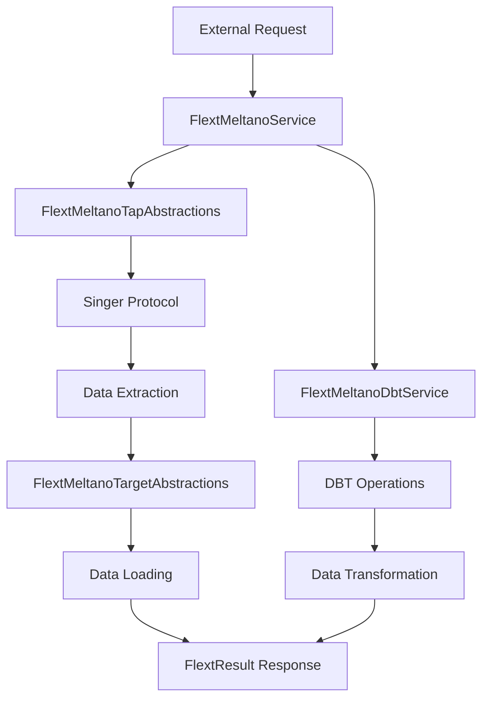

# flext-meltano Architecture

**Enterprise Meltano integration library architecture for the FLEXT ecosystem**

**Version**: 0.9.9 RC | **Last Updated**: 2025-09-17

---

## 🎯 Architectural Overview

flext-meltano serves as the foundational library for ELT operations within the FLEXT ecosystem, providing type-safe abstractions for Meltano, Singer protocol, and DBT operations. The architecture follows FLEXT ecosystem patterns with Clean Architecture principles and Domain-Driven Design.

### **Design Principles**

1. **Type Safety First** - Comprehensive type annotations with Pydantic models
2. **Railway-Oriented Programming** - FlextResult[T] pattern for error handling
3. **Single Responsibility** - One class per module with nested helpers
4. **FLEXT Ecosystem Integration** - Built on flext-core foundation patterns
5. **Abstraction Layers** - Clear separation between external libraries and FLEXT interfaces

## 🏗️ Module Architecture

### **Foundation Layer**

**Core Infrastructure and Type System**

```python
src/flext_meltano/
├── __init__.py              # Public API exports
├── constants.py             # MeltanoConstants extending FlextConstants
├── typings.py              # FlextMeltanoTypes with comprehensive type system
├── exceptions.py           # FlextMeltanoError hierarchy
└── validators.py           # FlextMeltanoValidators for data validation
```

**Purpose**: Provides foundational types, constants, and validation patterns that extend flext-core capabilities for ELT operations.

### **Service Layer**

**Business Logic and Services**

```python
├── services.py                    # FlextMeltanoService (core orchestration)
├── service_implementations.py     # Specialized service implementations
├── adapters.py                   # FlextMeltanoAdapter (external integration)
└── plugin_protocols.py          # Protocol definitions for plugins
```

**Key Components**:

- **FlextMeltanoService**: Unified service following FlextService pattern
- **Service Implementations**: FlextMeltanoTapService, FlextTargetService, FlextDbtService
- **Plugin Protocols**: TapServiceProtocol, TargetServiceProtocol, DbtServiceProtocol

### **Execution Layer**

**Command Processing and Integration**

```python
├── executors.py              # FlextMeltanoExecutor (command orchestration)
├── executors_bridge.py       # FlextMeltanoBridge (Go ↔ Python communication)
├── executors_cli.py          # FlextMeltanoCli (CLI command processing)
└── executors_meltano.py      # Simplified executor implementations
```

**Purpose**: Handles execution of ELT operations, CLI commands, and bridge communication with external systems.

### **Abstraction Layer**

**Protocol and Data Integration**

```python
├── singer_types.py           # FlextMeltanoTypes (Singer protocol abstractions)
├── tap_abstractions.py       # FlextMeltanoTapAbstractions with TapConfig, StreamDefinition
├── target_abstractions.py   # FlextMeltanoTargetAbstractions for target operations
└── file_managers.py         # FlextMeltanoFileManagers for file operations
```

**Purpose**: Provides type-safe abstractions for Singer protocol, data streams, and file operations.

### **Configuration Layer**

**Settings and Environment Management**

```python
├── config.py                # FlextMeltanoConfig (configuration management)
├── config_builders.py       # FlextMeltanoConfigBuilders (dynamic config)
└── utilities.py            # FlextMeltanoUtilities (helper functions)
```

**Purpose**: Manages configuration, environment settings, and utility functions for ELT operations.

## 🔄 Data Flow Architecture

### **ELT Pipeline Flow**



### **Error Handling Flow**

```mermaid
graph TD
    A[Operation Start] --> B{FlextResult Check}
    B -->|Success| C[Process Data]
    B -->|Failure| D[Error Propagation]
    C --> E{Validation}
    E -->|Valid| F[Continue Pipeline]
    E -->|Invalid| G[FlextResult.fail()]
    D --> H[Error Logging]
    G --> H
    F --> I[FlextResult.ok()]
```

## 🏛️ Clean Architecture Implementation

### **Layer Dependencies**

```
┌─────────────────────────────────────────┐
│            Interface Layer              │
│  (executors_cli.py, executors_bridge.py)│
├─────────────────────────────────────────┤
│           Application Layer             │
│     (services.py, executors.py)        │
├─────────────────────────────────────────┤
│             Domain Layer                │
│  (abstractions, protocols, types)      │
├─────────────────────────────────────────┤
│          Infrastructure Layer           │
│    (adapters.py, file_managers.py)     │
└─────────────────────────────────────────┘
```

### **Dependency Rules**

1. **Interface Layer** depends on Application Layer
2. **Application Layer** depends on Domain Layer
3. **Domain Layer** is independent (only flext-core dependencies)
4. **Infrastructure Layer** implements Domain interfaces

## 🔧 Integration Patterns

### **FLEXT Ecosystem Integration**

**flext-core Foundation**:

```python
from flext_core import (
    FlextResult,           # Railway-oriented programming
    FlextService,    # Service base class
    FlextLogger,           # Logging infrastructure
    FlextContainer,        # Dependency injection
    u         # Common utilities
)
```

**Type System Integration**:

```python
from flext_meltano.typings import FlextMeltanoTypes

# Comprehensive type system extending flext-core
pipeline_config: FlextMeltanoTypes.ELT.PipelineConfig
tap_config: FlextMeltanoTypes.Singer.TapConfig
result: FlextResult[FlextMeltanoTypes.ELT.PipelineResult]
```

### **External Library Integration**

**Current Status (Direct Imports)**:

```python
# ⚠️ ARCHITECTURE DEBT - Requires abstraction
import meltano                                    # Line 14 in adapters.py
from meltano.core.project import Project         # Line 22 in adapters.py
from meltano.core.plugin_invoker import PluginInvoker # Line 21 in adapters.py
```

**Target Architecture (Abstracted)**:

```python
# ✅ FUTURE STATE - Library wrapper pattern
class _MeltanoLibraryWrapper:
    """Internal wrapper for meltano library operations."""

    @staticmethod
    def create_project(path: Path) -> FlextResult[object]:
        """Create Meltano project through library API."""
        # Implementation with proper error handling
```

## 📊 Type System Architecture

### **FlextMeltanoTypes Hierarchy**

```python
class FlextMeltanoTypes:
    """Comprehensive type system for ELT operations."""

    class Plugin:
        """Meltano plugin management types."""
        type Name = str
        type Config = ConfigDict
        type Command = t.StringList

    class Singer:
        """Singer protocol integration types."""
        type Tap = object
        type Target = object
        type MessageType = str
        type RecordMessage = JsonObject

    class ELT:
        """Extract-Load-Transform pipeline types."""
        type Pipeline = ConfigDict
        type PipelineResult = JsonObject
        type ExtractResult = JsonObject
```

### **Pydantic Model Integration**

```python
class TapConfig(BaseModel):
    """Type-safe tap configuration model."""
    tap_type: str
    connection_config: t.Dict
    stream_config: t.Dict | None = None
    version: str | None = None

class StreamDefinition(BaseModel):
    """Type-safe stream definition model."""
    stream_name: str
    stream_schema: t.Dict
    tap_type: str
    status: str = "discovered"
    records_extracted: int = 0
```

## 🛡️ Error Handling Architecture

### **FlextResult Pattern Implementation**

```python
# All operations return FlextResult[T] for railway-oriented programming
def process_elt_pipeline(
    tap_config: TapConfig,
    target_config: t.Dict
) -> FlextResult[t.Dict]:
    """Process ELT pipeline with comprehensive error handling."""

    # Validation phase
    validation_result = validate_configuration(tap_config)
    if validation_result.is_failure:
        return FlextResult[t.Dict].fail(
            f"Configuration validation failed: {validation_result.error}"
        )

    # Execution phase
    execution_result = execute_pipeline(tap_config, target_config)
    if execution_result.is_failure:
        return FlextResult[t.Dict].fail(
            f"Pipeline execution failed: {execution_result.error}"
        )

    return FlextResult[t.Dict].ok(execution_result.unwrap())
```

### **Exception Hierarchy**

```python
class FlextMeltanoError(Exception):
    """Base exception for all flext-meltano operations."""

class FlextMeltanoConfigurationError(FlextMeltanoError):
    """Configuration-related errors."""

class FlextMeltanoExecutionError(FlextMeltanoError):
    """Pipeline execution errors."""

class FlextMeltanoValidationError(FlextMeltanoError):
    """Data validation errors."""
```

## 🎯 Current Status and Technical Debt

### **Architecture Compliance Status**

| Component                 | Status  | Details                                            |
| ------------------------- | ------- | -------------------------------------------------- |
| **Type Safety**           | 🟢 90%  | Comprehensive Pydantic models and type annotations |
| **FLEXT Integration**     | 🟢 85%  | Strong flext-core usage with FlextResult patterns  |
| **Single Class Pattern**  | 🟢 100% | All modules follow single class architecture       |
| **External Abstractions** | 🟡 60%  | Direct imports in adapters.py need wrapping        |

### **Technical Debt**

**Priority 1 - Critical**:

- **Direct Imports**: Lines 14-25 in `adapters.py` need abstraction layer
- **Library Wrapper**: Implement `_MeltanoLibraryWrapper` pattern

**Priority 2 - Important**:

- **Integration Testing**: Expand real API integration tests
- **Bridge Communication**: Complete Go ↔ Python bridge patterns

**Priority 3 - Enhancement**:

- **Plugin Architecture**: Ecosystem-wide plugin foundation
- **Performance**: Optimize for large data volume processing

## 🚀 Future Architecture

### **Target State**

1. **Complete Abstraction**: All external libraries wrapped behind FLEXT interfaces
2. **Enhanced Integration**: Full ecosystem integration with plugin architecture
3. **Production Readiness**: 100% test coverage with real API integration
4. **Performance Optimization**: Efficient processing for enterprise data volumes

### **Migration Path**

1. **Phase 1**: Implement library wrapper for direct imports
2. **Phase 2**: Expand integration testing coverage
3. **Phase 3**: Complete plugin architecture foundation
4. **Phase 4**: Performance optimization and production hardening

---

**Architecture Summary**: flext-meltano provides a robust, type-safe foundation for ELT operations within the FLEXT ecosystem, with clear separation of concerns, comprehensive error handling, and strong integration patterns. The current architecture debt primarily involves abstracting direct library dependencies behind FLEXT-compatible interfaces.

## Related Documentation

**Within Project**:

- [Getting Started](getting-started.md) - Installation and basic usage
- [API Reference](api-reference.md) - Complete API documentation
- [Examples](../examples/) - Working code examples

**Across Projects**:

- [flext-core Foundation](https://github.com/organization/flext/tree/main/flext-core/docs/architecture/overview.md) - Clean architecture and CQRS patterns
- [flext-plugin Architecture](https://github.com/organization/flext/tree/main/flext-plugin/docs/architecture.md) - Plugin architecture patterns
- [flext-quality Automation](https://github.com/organization/flext/tree/main/flext-quality/CLAUDE.md) - Quality analysis and automation

**External Resources**:

- [PEP 257 - Docstring Conventions](https://peps.python.org/pep-0257/)
- [Google Python Style Guide](https://google.github.io/styleguide/pyguide.html)

**Design Authority**: This architecture follows FLEXT ecosystem standards and Clean Architecture principles, ensuring maintainability, testability, and integration capability across the 32-project FLEXT ecosystem.
