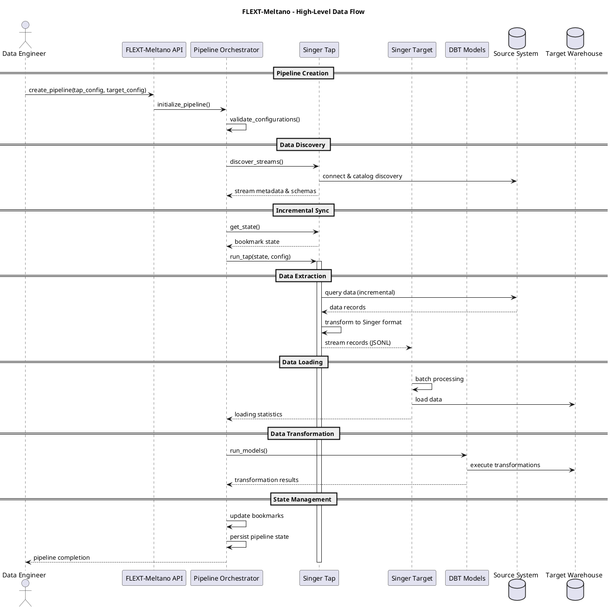
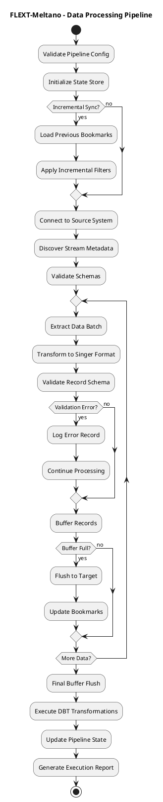
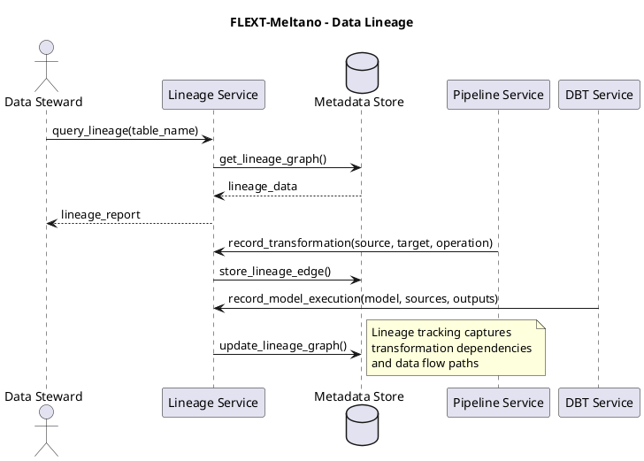

# Data Architecture Documentation

**FLEXT-Meltano Data Flow, Storage, and Processing Architecture**

**Version**: 1.0 | **Last Updated**: 2025-10-10

---

## 📋 Table of Contents

1. [Data Flow Architecture](#data-flow-architecture)
2. [Data Storage Strategy](#data-storage-strategy)
3. [Data Models and Schemas](#data-models-and-schemas)
4. [Data Processing Pipeline](#data-processing-pipeline)
5. [Data Quality and Validation](#data-quality-and-validation)
6. [Data Governance](#data-governance)
7. [Performance and Scalability](#performance-and-scalability)

---

## 🏗️ Data Flow Architecture

### High-Level Data Flow



### Data Flow Patterns

#### 1. **Extract-Load-Transform (ELT) Pattern**

```
Source System → Singer Tap → JSONL Stream → Singer Target → Raw Storage → DBT → Transformed Data
```

#### 2. **Incremental Loading Pattern**

```
State Store ← Bookmark Management ← Change Detection ← Source Query ← Filtered Extraction
```

#### 3. **Batch Processing Pattern**

```
Record Buffer ← Streaming Ingestion ← JSONL Parsing ← Schema Validation ← Batch Loading
```

### Data Transformation Stages

| Stage              | Input Format    | Processing      | Output Format    | Purpose                            |
| ------------------ | --------------- | --------------- | ---------------- | ---------------------------------- |
| **Extraction**     | Source Native   | Singer Tap      | JSONL Records    | Schema discovery, incremental sync |
| **Transportation** | JSONL Records   | Singer Protocol | JSONL Stream     | Standardized data transport        |
| **Loading**        | JSONL Stream    | Singer Target   | Target Native    | Raw data storage                   |
| **Transformation** | Raw Tables      | DBT Models      | Analytics Tables | Business logic, cleansing          |
| **Orchestration**  | Pipeline Config | FLEXT-Meltano   | Execution State  | Workflow coordination              |

---

## 💾 Data Storage Strategy

### Storage Layer Architecture

```plantuml
@startuml Data Storage Architecture
title FLEXT-Meltano - Data Storage Strategy

package "Pipeline State & Metadata" as metadata {
    database "SQLite/PostgreSQL" as state_db [
        Pipeline Metadata
        Execution History
        Singer State/Bookmarks
        Configuration Store
    ]
}

package "Intermediate Data Storage" as intermediate {
    file "JSONL Files" as jsonl [
        Raw Extracted Data
        Temporary Buffers
        Error Records
    ]

    file "CSV/Parquet" as files [
        Bulk Load Files
        Archive Storage
        Backup Files
    ]
}

package "Target Data Storage" as target {
    database "Data Warehouse" as warehouse [
        Raw Landing Tables
        Staging Tables
        Analytics Tables
        Dimension Tables
    ]
}

package "External Systems" as external {
    database "Source Systems" as sources [
        OLTP Databases
        APIs, Files
        Legacy Systems
    ]
}

metadata --> intermediate: Pipeline configuration
intermediate --> target: Raw data loading
target --> target: DBT transformations
external --> intermediate: Data extraction
@enduml
```

### Storage Technologies

| Storage Type         | Technology        | Purpose                    | Retention          | Access Pattern               |
| -------------------- | ----------------- | -------------------------- | ------------------ | ---------------------------- |
| **Pipeline State**   | SQLite/PostgreSQL | Execution state, bookmarks | Indefinite         | Read-heavy, frequent updates |
| **Raw Data**         | JSONL/Parquet     | Extracted data staging     | Configurable       | Write-once, read-many        |
| **Transformed Data** | Data Warehouse    | Analytics-ready data       | Business rules     | Complex queries, reporting   |
| **Configuration**    | YAML/JSON         | Pipeline definitions       | Version controlled | Read-mostly                  |
| **Logs & Metrics**   | Structured logs   | Observability              | Configurable       | Time-series queries          |

### Data Persistence Patterns

#### 1. **State Management**

```python
class PipelineState:
    """Pipeline execution state with bookmarks."""
    pipeline_id: str
    bookmarks: Dict[str, object]  # Singer bookmark format
    last_updated: datetime
    version: int

    def update_bookmark(self, stream: str, value: object) -> None:
        """Update bookmark for incremental sync."""
        self.bookmarks[stream] = value
        self.last_updated = datetime.utcnow()
        self.version += 1
```

#### 2. **Data Buffering**

```python
class RecordBuffer:
    """In-memory buffer for batch processing."""
    records: List[dict]
    max_size: int
    flush_threshold: float

    def add_record(self, record: dict) -> bool:
        """Add record to buffer, return True if flush needed."""
        self.records.append(record)
        return len(self.records) >= self.max_size * self.flush_threshold
```

#### 3. **Error Handling Storage**

```python
class ErrorStore:
    """Storage for failed records and error context."""
    errors: List[ErrorRecord]

    @dataclass
    class ErrorRecord:
        record: dict
        error_message: str
        timestamp: datetime
        retry_count: int
        pipeline_stage: str
```

---

## 📊 Data Models and Schemas

### Core Data Models

#### Pipeline Configuration Model

```python
@dataclass
class PipelineConfig:
    """Pipeline configuration with validation."""
    name: str
    tap: TapConfig
    target: TargetConfig
    transforms: List[TransformConfig] = field(default_factory=list)
    schedule: Optional[str] = None

    def validate(self) -> FlextCore.Result[ValidatedConfig]:
        """Validate complete pipeline configuration."""
        return (
            self.tap.validate()
            .flat_map(lambda tap: self.target.validate())
            .map(lambda target: ValidatedConfig(tap=tap, target=target, transforms=self.transforms))
        )
```

#### Singer Message Schema

```json
{
  "$schema": "http://json-schema.org/draft-07/schema#",
  "type": "object",
  "oneOf": [
    {
      "properties": {
        "type": { "const": "RECORD" },
        "stream": { "type": "string" },
        "record": { "type": "object" },
        "time_extracted": { "type": "string", "format": "date-time" }
      },
      "required": ["type", "stream", "record"]
    },
    {
      "properties": {
        "type": { "const": "STATE" },
        "value": { "type": "object" }
      },
      "required": ["type", "value"]
    },
    {
      "properties": {
        "type": { "const": "SCHEMA" },
        "stream": { "type": "string" },
        "schema": { "$ref": "http://json-schema.org/draft-07/schema#" },
        "key_properties": { "type": "array", "items": { "type": "string" } }
      },
      "required": ["type", "stream", "schema"]
    }
  ]
}
```

### Data Validation Rules

#### Schema Validation

```python
class SchemaValidator:
    """Singer schema validation with FLEXT patterns."""

    def validate_record(self, record: dict, schema: dict) -> FlextCore.Result[ValidatedRecord]:
        """Validate record against Singer schema."""
        try:
            # JSON Schema validation
            validate(instance=record, schema=schema)
            return FlextCore.Result.ok(ValidatedRecord(record=record, schema=schema))
        except ValidationError as e:
            return FlextCore.Result.fail(ValidationError(f"Schema validation failed: {e.message}"))

    def validate_stream_schema(self, schema: dict) -> FlextCore.Result[ValidatedSchema]:
        """Validate Singer stream schema."""
        required_fields = ['type', 'properties']
        if not all(field in schema for field in required_fields):
            return FlextCore.Result.fail(SchemaError("Invalid Singer schema structure"))

        return FlextCore.Result.ok(ValidatedSchema(schema=schema))
```

---

## 🔄 Data Processing Pipeline

### Pipeline Execution Flow



### Processing Stages

#### 1. **Data Extraction Stage**

- **Input**: Source system queries
- **Processing**: Incremental filtering, type conversion
- **Output**: Singer RECORD messages
- **Error Handling**: Connection retries, partial failure recovery

#### 2. **Data Transportation Stage**

- **Input**: Singer RECORD stream
- **Processing**: JSONL serialization, compression
- **Output**: Transport-ready data stream
- **Error Handling**: Stream integrity checks, reconnection logic

#### 3. **Data Loading Stage**

- **Input**: JSONL data stream
- **Processing**: Batch optimization, duplicate handling
- **Output**: Raw warehouse tables
- **Error Handling**: Transaction rollbacks, dead letter queues

#### 4. **Data Transformation Stage**

- **Input**: Raw warehouse tables
- **Processing**: Business logic, data cleansing, aggregation
- **Output**: Analytics-ready tables
- **Error Handling**: Model validation, dependency resolution

---

## 🛡️ Data Quality and Validation

### Quality Gates

| Quality Gate              | Validation Rules        | Failure Action            |
| ------------------------- | ----------------------- | ------------------------- |
| **Schema Compliance**     | JSON Schema validation  | Reject record, log error  |
| **Data Type Consistency** | Type coercion rules     | Transform or reject       |
| **Referential Integrity** | Foreign key validation  | Conditional loading       |
| **Business Rules**        | Custom validation logic | Reject or flag            |
| **Completeness**          | Required field checks   | Reject incomplete records |

### Data Quality Metrics

```python
class DataQualityMetrics:
    """Track data quality throughout pipeline."""

    def __init__(self):
        self.total_records = 0
        self.valid_records = 0
        self.invalid_records = 0
        self.duplicate_records = 0
        self.schema_errors = 0
        self.business_rule_violations = 0

    def calculate_quality_score(self) -> float:
        """Calculate overall data quality score."""
        if self.total_records == 0:
            return 100.0

        valid_percentage = (self.valid_records / self.total_records) * 100
        error_penalty = min((self.invalid_records / self.total_records) * 50, 25)

        return max(0, valid_percentage - error_penalty)
```

### Error Handling Strategies

#### 1. **Schema Validation Errors**

- Log error details with record context
- Continue processing other records
- Aggregate error statistics
- Optional: Store invalid records in error table

#### 2. **Business Rule Violations**

- Categorize violation types
- Apply configurable actions (reject/warn/transform)
- Maintain violation audit trail
- Support rule configuration updates

#### 3. **System Errors**

- Implement retry logic with exponential backoff
- Circuit breaker pattern for external systems
- Graceful degradation strategies
- Alert escalation for critical failures

---

## 🎯 Data Governance

### Data Lineage Tracking



### Data Classification and Security

| Data Classification | Handling Requirements   | Storage Requirements |
| ------------------- | ----------------------- | -------------------- |
| **Public**          | No restrictions         | Standard storage     |
| **Internal**        | Access controls         | Encrypted at rest    |
| **Confidential**    | Role-based access       | Encrypted + audited  |
| **Restricted**      | Need-to-know only       | Encrypted + masked   |
| **PHI/PII**         | Compliance requirements | Tokenized + audited  |

### Data Retention Policies

```python
@dataclass
class RetentionPolicy:
    """Data retention policy configuration."""
    data_type: str
    retention_period_days: int
    archive_strategy: str  # 'delete', 'archive', 'anonymize'
    compliance_requirements: FlextCore.Types.StringList

    def should_retain(self, data_age_days: int) -> bool:
        """Determine if data should be retained."""
        return data_age_days <= self.retention_period_days

    def get_archive_action(self) -> str:
        """Get appropriate archive action."""
        return self.archive_strategy
```

---

## ⚡ Performance and Scalability

### Performance Characteristics

| Operation                  | Target Latency | Throughput    | Scaling Strategy   |
| -------------------------- | -------------- | ------------- | ------------------ |
| **Schema Discovery**       | <30s           | N/A           | Parallel discovery |
| **Data Extraction**        | <5min          | 1000 rec/sec  | Horizontal scaling |
| **Data Loading**           | <10min         | 5000 rec/sec  | Batch optimization |
| **DBT Transformation**     | <15min         | Variable      | Query optimization |
| **Pipeline Orchestration** | <1min          | 10 concurrent | Load balancing     |

### Scalability Patterns

#### 1. **Horizontal Scaling**

```python
class PipelineScaler:
    """Dynamic pipeline scaling based on workload."""

    def scale_pipeline(self, pipeline: Pipeline, metrics: SystemMetrics) -> ScalingDecision:
        """Determine scaling requirements."""
        if metrics.queue_depth > self.queue_threshold:
            return ScalingDecision(scale_up=True, instances=2)
        elif metrics.cpu_usage < self.cpu_threshold:
            return ScalingDecision(scale_down=True, instances=max(1, current_instances - 1))
        else:
            return ScalingDecision(scale_up=False, scale_down=False)
```

#### 2. **Data Partitioning**

```python
class DataPartitioner:
    """Intelligent data partitioning for parallel processing."""

    def partition_data(self, records: List[dict], partition_key: str) -> Dict[str, List[dict]]:
        """Partition data for parallel processing."""
        partitions = defaultdict(list)

        for record in records:
            key = record.get(partition_key, 'default')
            partitions[key].append(record)

        return dict[str, object](partitions)
```

#### 3. **Caching Strategy**

```python
class PipelineCache:
    """Multi-level caching for performance optimization."""

    def __init__(self):
        self.schema_cache = {}  # Schema metadata cache
        self.config_cache = {}  # Configuration cache
        self.result_cache = {}  # Computation result cache

    def get_cached_schema(self, stream_name: str) -> Optional[dict]:
        """Get cached schema with TTL validation."""
        if stream_name in self.schema_cache:
            cached_item = self.schema_cache[stream_name]
            if not self._is_expired(cached_item):
                return cached_item['schema']
        return None
```

### Monitoring and Observability

#### Key Metrics

- **Throughput**: Records processed per second
- **Latency**: End-to-end pipeline execution time
- **Error Rate**: Percentage of failed operations
- **Resource Usage**: CPU, memory, disk I/O
- **Data Quality**: Validation success rate

#### Alerting Rules

```python
@dataclass
class AlertRule:
    """Monitoring alert configuration."""
    metric_name: str
    condition: str  # '>', '<', '==', '!='
    threshold: float
    severity: str  # 'info', 'warning', 'error', 'critical'
    cooldown_minutes: int

    def should_alert(self, current_value: float, last_alert: datetime) -> bool:
        """Determine if alert should be triggered."""
        condition_met = self._check_condition(current_value)
        cooldown_expired = self._is_cooldown_expired(last_alert)

        return condition_met and cooldown_expired
```

---

## 📈 Architecture Evolution

### Current Limitations

- Single-threaded processing for some operations
- Memory-bound for very large datasets
- Limited support for complex data transformations
- Basic error recovery mechanisms

### Future Enhancements

- **Streaming Architecture**: Real-time data processing
- **Distributed Processing**: Cluster-based execution
- **Advanced Caching**: Multi-level caching strategies
- **AI/ML Integration**: Intelligent data quality assessment
- **Event-Driven Processing**: Asynchronous pipeline execution

---

**Data Architecture**: FLEXT-Meltano Enterprise Data Processing
_Comprehensive data flow, storage, and processing architecture documentation_
