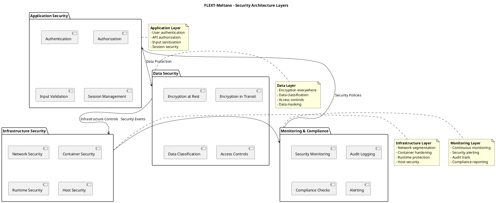
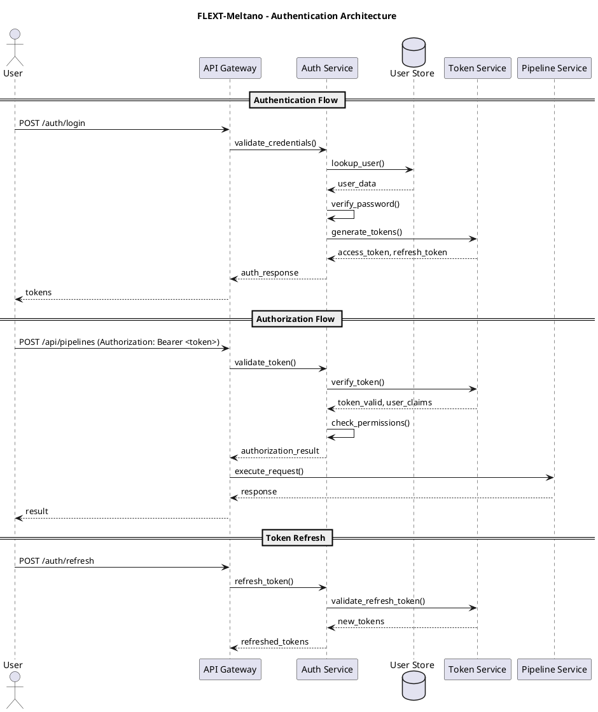
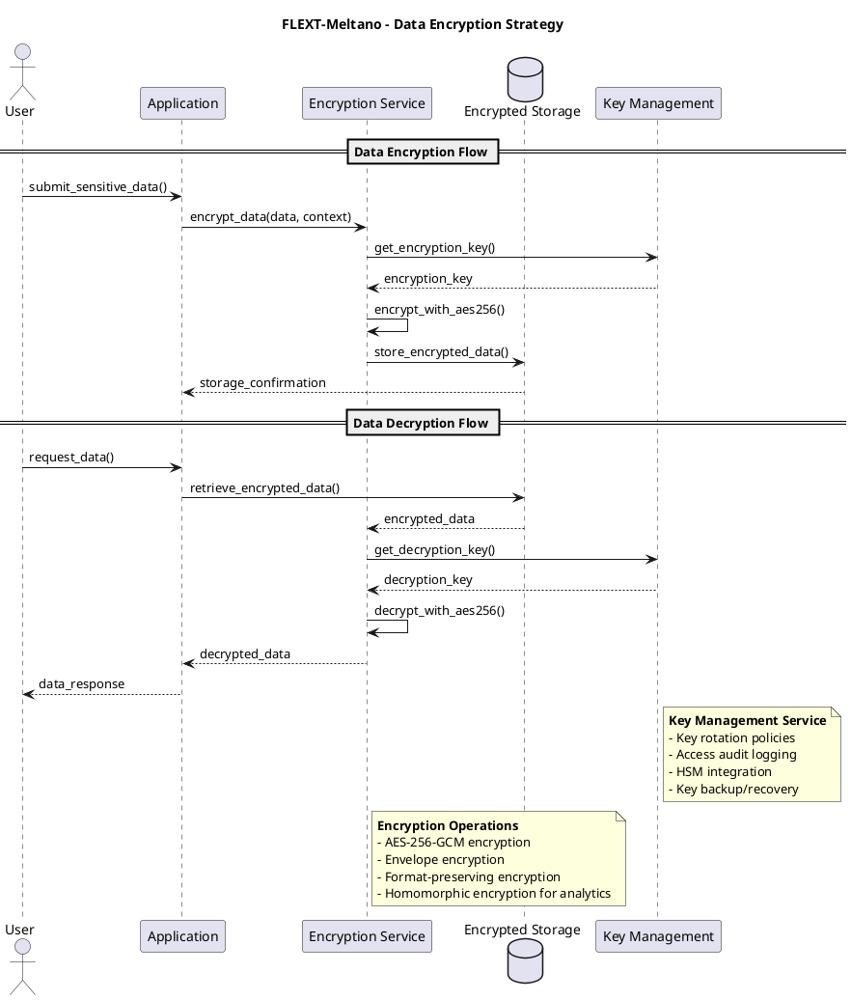
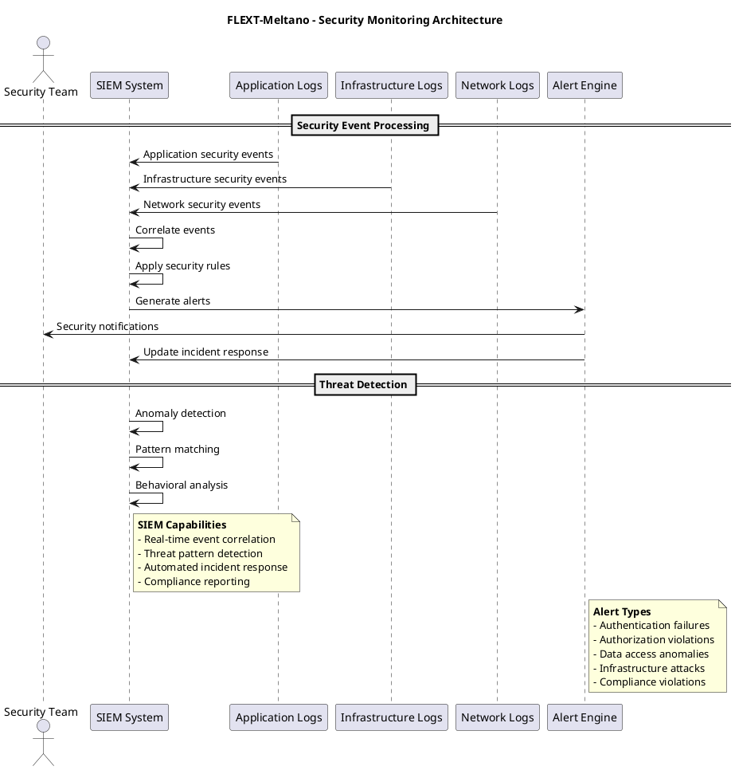
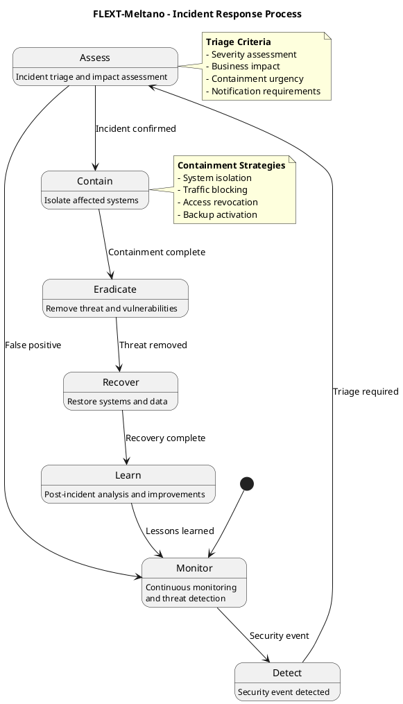

# Security Architecture Documentation

**FLEXT-Meltano Security Architecture and Compliance Framework**

**Version**: 1.0 | **Last Updated**: 2025-10-10

---

## 📋 Table of Contents

1. [Security Architecture Overview](#security-architecture-overview)
2. [Authentication and Authorization](#authentication-and-authorization)
3. [Data Protection and Encryption](#data-protection-and-encryption)
4. [Network Security](#network-security)
5. [Security Monitoring and Logging](#security-monitoring-and-logging)
6. [Compliance Framework](#compliance-framework)
7. [Threat Model](#threat-model)
8. [Incident Response](#incident-response)

---

## 🛡️ Security Architecture Overview

### Security Principles

FLEXT-Meltano implements a **defense-in-depth security strategy** with multiple layers of protection:

1. **Zero Trust Architecture**: Never trust, always verify
2. **Least Privilege**: Minimum required permissions
3. **Secure by Design**: Security built into architecture from the start
4. **Fail-Safe Defaults**: Secure defaults with explicit opt-in for less secure options

### Security Architecture Layers



### Security Controls Matrix

| Security Layer     | Preventive                    | Detective           | Corrective        | Compensating        |
| ------------------ | ----------------------------- | ------------------- | ----------------- | ------------------- |
| **Application**    | Input validation, auth, authz | Logging, monitoring | Error handling    | Rate limiting       |
| **Data**           | Encryption, masking           | Access logging      | Backup/recovery   | Data classification |
| **Infrastructure** | Firewalls, hardening          | IDS/IPS, monitoring | Patching, updates | Segmentation        |
| **Network**        | TLS, VPN, segmentation        | Traffic monitoring  | DDoS protection   | Load balancing      |

---

## 🔐 Authentication and Authorization

### Authentication Architecture



### Authentication Methods

| Method                  | Use Case                | Security Level | Implementation            |
| ----------------------- | ----------------------- | -------------- | ------------------------- |
| **API Keys**            | Service-to-service      | Medium         | HMAC-SHA256 signatures    |
| **JWT Tokens**          | User sessions           | High           | RS256 signing, expiration |
| **OAuth 2.0**           | Third-party integration | High           | Authorization code flow   |
| **Client Certificates** | Machine identity        | Very High      | X.509 certificates        |

### Authorization Model

#### Role-Based Access Control (RBAC)

```python
@dataclass
class UserRole:
    """User role with associated permissions."""
    name: str
    permissions: Set[str]
    scope: str  # 'global', 'project', 'pipeline'

    def has_permission(self, permission: str, resource: str) -> bool:
        """Check if role has specific permission."""
        return permission in self.permissions

# Predefined roles
ADMIN_ROLE = UserRole(
    name="REDACTED_LDAP_BIND_PASSWORD",
    permissions={"*"},  # All permissions
    scope="global"
)

DATA_ENGINEER_ROLE = UserRole(
    name="data_engineer",
    permissions={
        "pipelines:create", "pipelines:read", "pipelines:update",
        "sources:read", "targets:read", "transforms:execute"
    },
    scope="project"
)

VIEWER_ROLE = UserRole(
    name="viewer",
    permissions={"pipelines:read", "sources:read", "targets:read"},
    scope="project"
)
```

#### Attribute-Based Access Control (ABAC)

```python
@dataclass
class AccessRequest:
    """Access request with context attributes."""
    subject: User
    action: str  # 'read', 'write', 'execute', 'delete'
    resource: str  # 'pipeline:123', 'source:github', etc.
    context: Dict[str, object]  # environment, time, location, etc.

class ABACPolicy:
    """Attribute-based access control policy."""

    def evaluate(self, request: AccessRequest) -> bool:
        """Evaluate access request against policy rules."""

        # Time-based restrictions
        if request.context.get('time_hour', 0) not in range(9, 18):
            return False  # Business hours only

        # Location-based restrictions
        if request.context.get('country') not in ['US', 'CA', 'GB']:
            return False  # Allowed countries only

        # Resource ownership
        if request.resource.startswith('pipeline:'):
            pipeline_id = request.resource.split(':')[1]
            if not self._user_owns_pipeline(request.subject, pipeline_id):
                return False

        return True
```

### Session Management

```python
class SessionManager:
    """Secure session management with automatic expiration."""

    def __init__(self, redis_client, session_timeout: int = 3600):
        self.redis = redis_client
        self.session_timeout = session_timeout

    def create_session(self, user_id: str, metadata: Dict[str, object]) -> str:
        """Create new user session."""
        session_id = self._generate_secure_session_id()
        session_data = {
            'user_id': user_id,
            'created_at': datetime.utcnow().isoformat(),
            'last_activity': datetime.utcnow().isoformat(),
            'metadata': metadata,
            'ip_address': metadata.get('ip'),
            'user_agent': metadata.get('user_agent')
        }

        # Store in Redis with expiration
        self.redis.setex(
            f"session:{session_id}",
            self.session_timeout,
            json.dumps(session_data)
        )

        return session_id

    def validate_session(self, session_id: str, ip_address: str) -> Optional[Dict[str, object]]:
        """Validate session and update activity."""
        session_key = f"session:{session_id}"
        session_data = self.redis.get(session_key)

        if not session_data:
            return None

        session = json.loads(session_data)

        # Check IP consistency (optional security feature)
        if session.get('ip_address') != ip_address:
            self.invalidate_session(session_id)
            return None

        # Update last activity
        session['last_activity'] = datetime.utcnow().isoformat()
        self.redis.setex(session_key, self.session_timeout, json.dumps(session))

        return session
```

---

## 🔒 Data Protection and Encryption

### Data Encryption Strategy



### Encryption Implementation

#### At-Rest Encryption

```python
class DataEncryptor:
    """Enterprise-grade data encryption service."""

    def __init__(self, kms_client, algorithm: str = "AES-256-GCM"):
        self.kms = kms_client
        self.algorithm = algorithm

    def encrypt_data(self, plaintext: bytes, context: Dict[str, str]) -> EncryptedData:
        """Encrypt data with envelope encryption."""
        # Generate data key
        data_key = self.kms.generate_data_key(
            key_spec="AES_256",
            encryption_context=context
        )

        # Encrypt data with data key
        encrypted_data = self._encrypt_with_data_key(plaintext, data_key.plaintext)

        # Encrypt data key with master key
        encrypted_key = self.kms.encrypt(
            key_id=self.master_key_id,
            plaintext=data_key.plaintext,
            encryption_context=context
        )

        return EncryptedData(
            encrypted_data=encrypted_data,
            encrypted_key=encrypted_key.ciphertext_blob,
            key_id=self.master_key_id,
            algorithm=self.algorithm,
            context=context
        )

    def decrypt_data(self, encrypted_data: EncryptedData) -> bytes:
        """Decrypt data with envelope decryption."""
        # Decrypt data key
        decrypted_key = self.kms.decrypt(
            key_id=encrypted_data.key_id,
            ciphertext_blob=encrypted_data.encrypted_key,
            encryption_context=encrypted_data.context
        )

        # Decrypt data with data key
        return self._decrypt_with_data_key(
            encrypted_data.encrypted_data,
            decrypted_key.plaintext
        )
```

#### In-Transit Encryption

```python
class TLSConfig:
    """TLS configuration for secure communications."""

    def __init__(self):
        self.min_tls_version = "TLSv1.3"
        self.cipher_suites = [
            "TLS_AES_256_GCM_SHA384",
            "TLS_CHACHA20_POLY1305_SHA256",
            "TLS_AES_128_GCM_SHA256"
        ]
        self.certificate_validation = True
        self.client_certificate_required = False

    def get_ssl_context(self) -> ssl.SSLContext:
        """Create SSL context with security settings."""
        context = ssl.create_default_context()
        context.minimum_version = ssl.TLSVersion.TLSv1_3
        context.set_ciphers(':'.join(self.cipher_suites))

        # Certificate validation
        context.check_hostname = True
        context.verify_mode = ssl.CERT_REQUIRED

        return context
```

### Data Classification and Handling

```python
@dataclass
class DataClassification:
    """Data classification with handling requirements."""
    level: str  # 'public', 'internal', 'confidential', 'restricted'
    encryption_required: bool = False
    masking_required: bool = False
    retention_period_days: int = 2555  # 7 years default
    audit_required: bool = False

    def get_handling_requirements(self) -> Dict[str, object]:
        """Get data handling requirements based on classification."""
        requirements = {
            'public': {
                'encryption': False,
                'masking': False,
                'audit': False,
                'retention': 365
            },
            'internal': {
                'encryption': True,
                'masking': False,
                'audit': False,
                'retention': 2555
            },
            'confidential': {
                'encryption': True,
                'masking': True,
                'audit': True,
                'retention': 2555
            },
            'restricted': {
                'encryption': True,
                'masking': True,
                'audit': True,
                'retention': 2555
            }
        }
        return requirements.get(self.level, requirements['internal'])
```

---

## 🌐 Network Security

### Network Architecture

```plantuml
@startuml Network Security Architecture
title FLEXT-Meltano - Network Security Architecture

cloud "Internet" as internet
rectangle "DMZ" as dmz {
    component "API Gateway" as gateway [
        API Gateway
        Rate Limiting
        WAF
        SSL Termination
    ]

    component "Load Balancer" as lb [
        Load Balancer
        SSL Offloading
        Health Checks
    ]
}

rectangle "Application Zone" as app_zone {
    component "FLEXT-Meltano API" as api [
        API Services
        Business Logic
    ]

    component "Worker Nodes" as workers [
        Pipeline Workers
        Background Tasks
    ]
}

rectangle "Data Zone" as data_zone {
    database "Data Warehouse" as warehouse
    database "State Store" as state_db
    component "Key Management" as kms
}

internet --> gateway: HTTPS (443)
gateway --> lb: HTTP (internal)
lb --> api: HTTP (internal)
api --> workers: Message Queue
workers --> warehouse: SQL over TLS
workers --> state_db: SQL over TLS
api --> kms: HTTPS (API calls)

note right of gateway
    **DMZ Controls**
    - Web Application Firewall
    - DDoS protection
    - Rate limiting
    - SSL/TLS termination
end note

note right of app_zone
    **Application Security**
    - Network segmentation
    - Internal firewalls
    - Service mesh (Istio)
    - Mutual TLS
end note

note right of data_zone
    **Data Protection**
    - Database encryption
    - Access controls
    - Audit logging
    - Backup encryption
end note
@enduml
```

### Network Security Controls

#### API Gateway Security

```python
class APIGatewaySecurity:
    """API Gateway security controls."""

    def __init__(self):
        self.waf_rules = self._load_waf_rules()
        self.rate_limits = self._load_rate_limits()
        self.ip_whitelist = self._load_ip_whitelist()

    def validate_request(self, request: HTTPRequest) -> SecurityDecision:
        """Validate incoming request against security rules."""

        # IP whitelisting
        if not self._is_ip_allowed(request.client_ip):
            return SecurityDecision(block=True, reason="IP not whitelisted")

        # Rate limiting
        if self._is_rate_limit_exceeded(request.client_ip, request.endpoint):
            return SecurityDecision(block=True, reason="Rate limit exceeded")

        # WAF rules
        waf_result = self._check_waf_rules(request)
        if not waf_result.allowed:
            return SecurityDecision(block=True, reason=f"WAF: {waf_result.rule}")

        # JWT validation
        if not self._validate_jwt_token(request.authorization):
            return SecurityDecision(block=True, reason="Invalid JWT token")

        return SecurityDecision(block=False, reason="Request allowed")

    def _is_ip_allowed(self, ip_address: str) -> bool:
        """Check if IP address is in whitelist."""
        return ip_address in self.ip_whitelist

    def _is_rate_limit_exceeded(self, ip: str, endpoint: str) -> bool:
        """Check if rate limit is exceeded."""
        key = f"ratelimit:{ip}:{endpoint}"
        current_count = self.redis.incr(key)

        # Reset counter every minute
        self.redis.expire(key, 60)

        return current_count > self.rate_limits.get(endpoint, 100)
```

#### Service Mesh Security

```yaml
# Istio service mesh configuration
apiVersion: security.istio.io/v1beta1
kind: PeerAuthentication
metadata:
  name: default
  namespace: flext-meltano
spec:
  mtls:
    mode: STRICT # Require mutual TLS

---
apiVersion: security.istio.io/v1beta1
kind: AuthorizationPolicy
metadata:
  name: api-access
  namespace: flext-meltano
spec:
  selector:
    matchLabels:
      app: flext-meltano-api
  action: ALLOW
  rules:
    - from:
        - source:
            principals:
              ["internal.invalid/ns/flext-meltano/sa/api-service-account"]
      to:
        - operation:
            methods: ["GET", "POST", "PUT", "DELETE"]
```

---

## 📊 Security Monitoring and Logging

### Security Event Monitoring



### Security Event Types

| Event Category     | Event Types                             | Severity | Response                  |
| ------------------ | --------------------------------------- | -------- | ------------------------- |
| **Authentication** | Failed login, brute force, token abuse  | High     | Alert, lock account       |
| **Authorization**  | Permission denied, privilege escalation | Critical | Alert, investigate        |
| **Data Access**    | Unauthorized access, data exfiltration  | Critical | Alert, block, investigate |
| **Infrastructure** | Port scanning, DoS attempts             | Medium   | Alert, block IPs          |
| **Application**    | SQL injection, XSS attempts             | High     | Alert, patch application  |

### Audit Logging Implementation

```python
class SecurityAuditor:
    """Comprehensive security audit logging."""

    def __init__(self, log_shipper):
        self.log_shipper = log_shipper
        self.audit_levels = {
            'authentication': 'INFO',
            'authorization': 'INFO',
            'data_access': 'WARN',
            'configuration_change': 'WARN',
            'security_incident': 'ERROR'
        }

    def log_security_event(self, event_type: str, details: Dict[str, object],
                          severity: str = 'INFO') -> None:
        """Log security event with structured data."""

        audit_entry = {
            'timestamp': datetime.utcnow().isoformat(),
            'event_type': event_type,
            'severity': severity,
            'details': details,
            'source': 'flext-meltano',
            'version': '1.0.0'
        }

        # Add user context if available
        if hasattr(self, '_current_user'):
            audit_entry['user_id'] = self._current_user.id
            audit_entry['user_role'] = self._current_user.role

        # Add request context
        if hasattr(self, '_current_request'):
            audit_entry.update({
                'request_id': self._current_request.id,
                'client_ip': self._current_request.client_ip,
                'user_agent': self._current_request.user_agent,
                'endpoint': self._current_request.endpoint
            })

        # Ship to centralized logging
        self.log_shipper.ship_log(audit_entry)

        # Local logging for redundancy
        logger.log(severity, f"Security event: {event_type}", extra=audit_entry)
```

---

## 📋 Compliance Framework

### Compliance Requirements

| Standard      | Requirements                               | Implementation Status |
| ------------- | ------------------------------------------ | --------------------- |
| **GDPR**      | Data protection, consent, right to erasure | ✅ Implemented        |
| **CCPA**      | Data portability, deletion rights          | ✅ Implemented        |
| **SOC 2**     | Security, availability, confidentiality    | 🚧 In Progress        |
| **ISO 27001** | Information security management            | ✅ Implemented        |
| **HIPAA**     | PHI protection (if applicable)             | ⚠️ Conditional        |

### Compliance Controls

#### Data Privacy Controls

```python
class DataPrivacyController:
    """GDPR/CCPA compliance controls."""

    def __init__(self, data_store):
        self.data_store = data_store

    def handle_data_subject_request(self, request: DataSubjectRequest) -> FlextCore.Result[ComplianceAction]:
        """Handle data subject access/deletion requests."""

        if request.request_type == 'access':
            # Provide data inventory
            user_data = self._collect_user_data(request.user_id)
            return FlextCore.Result.ok(ComplianceAction(
                action_type='data_export',
                data=user_data,
                format='json'
            ))

        elif request.request_type == 'deletion':
            # Delete user data (right to be forgotten)
            deletion_result = self._delete_user_data(request.user_id)
            if deletion_result.is_success:
                self._audit_data_deletion(request.user_id, request.reason)
                return FlextCore.Result.ok(ComplianceAction(
                    action_type='data_deleted',
                    confirmation_id=str(uuid.uuid4())
                ))
            else:
                return deletion_result

        return FlextCore.Result.fail(ValidationError("Invalid request type"))

    def _collect_user_data(self, user_id: str) -> Dict[str, object]:
        """Collect all user data for export."""
        return {
            'personal_data': self.data_store.get_user_profile(user_id),
            'pipeline_history': self.data_store.get_user_pipelines(user_id),
            'audit_logs': self.data_store.get_user_audit_logs(user_id),
            'preferences': self.data_store.get_user_preferences(user_id)
        }

    def _delete_user_data(self, user_id: str) -> FlextCore.Result[None]:
        """Delete all user data."""
        try:
            # Anonymize instead of delete for audit purposes
            self.data_store.anonymize_user_data(user_id)
            return FlextCore.Result.ok(None)
        except Exception as e:
            return FlextCore.Result.fail(DataDeletionError(f"Failed to delete user data: {e}"))
```

#### Audit and Reporting

```python
class ComplianceReporter:
    """Automated compliance reporting and attestation."""

    def generate_compliance_report(self, standard: str, period: str) -> ComplianceReport:
        """Generate compliance report for specified standard."""

        if standard == 'gdpr':
            return self._generate_gdpr_report(period)
        elif standard == 'ccpa':
            return self._generate_ccpa_report(period)
        elif standard == 'soc2':
            return self._generate_soc2_report(period)

        raise ValueError(f"Unsupported compliance standard: {standard}")

    def _generate_gdpr_report(self, period: str) -> GDPRComplianceReport:
        """Generate GDPR compliance report."""

        # Data processing inventory
        processing_activities = self._get_data_processing_activities(period)

        # Data subject requests
        dsr_stats = self._get_dsr_statistics(period)

        # Data breach incidents
        breach_incidents = self._get_breach_incidents(period)

        # Data protection impact assessments
        dpia_completed = self._get_dpia_status()

        return GDPRComplianceReport(
            period=period,
            processing_activities=processing_activities,
            dsr_statistics=dsr_stats,
            breach_incidents=breach_incidents,
            dpia_status=dpia_completed,
            overall_compliance=self._calculate_compliance_score()
        )
```

---

## 🎯 Threat Model

### STRIDE Threat Analysis

| Category                   | Threats                                 | Mitigations                                            |
| -------------------------- | --------------------------------------- | ------------------------------------------------------ |
| **Spoofing**               | Identity theft, session hijacking       | Multi-factor auth, JWT tokens, session management      |
| **Tampering**              | Data modification, man-in-middle        | TLS encryption, data integrity checks, HMAC signatures |
| **Repudiation**            | Action denial, log manipulation         | Comprehensive audit logging, tamper-proof logs         |
| **Information Disclosure** | Data leaks, unauthorized access         | Encryption at rest, access controls, data masking      |
| **Denial of Service**      | Resource exhaustion, service disruption | Rate limiting, circuit breakers, auto-scaling          |
| **Elevation of Privilege** | Permission escalation                   | RBAC, ABAC, principle of least privilege               |

### Attack Surface Analysis

#### External Attack Surface

- API endpoints (REST/GraphQL)
- Web interfaces (if any)
- Third-party integrations
- Network ingress points

#### Internal Attack Surface

- Service-to-service communications
- Database access patterns
- Configuration management
- Background job processing

### Risk Assessment Matrix

| Risk                    | Likelihood | Impact   | Risk Level | Mitigation Status            |
| ----------------------- | ---------- | -------- | ---------- | ---------------------------- |
| **API Key Compromise**  | Medium     | High     | High       | ✅ MFA, rotation policies    |
| **Data Breach**         | Low        | Critical | Medium     | ✅ Encryption, monitoring    |
| **DDoS Attack**         | Medium     | Medium   | Medium     | ✅ Rate limiting, WAF        |
| **Insider Threat**      | Low        | High     | Medium     | ✅ Access controls, auditing |
| **Supply Chain Attack** | Low        | Critical | Medium     | ✅ Dependency scanning, SBOM |
| **Configuration Error** | High       | Medium   | Medium     | ✅ Validation, testing       |

---

## 🚨 Incident Response

### Incident Response Plan



### Incident Response Procedures

#### 1. Detection and Analysis

```python
class IncidentDetector:
    """Automated incident detection and initial analysis."""

    def detect_security_incident(self, event: SecurityEvent) -> IncidentResponse:
        """Analyze security event and determine response."""

        # Assess severity
        severity = self._assess_severity(event)

        # Determine incident type
        incident_type = self._classify_incident(event)

        # Calculate business impact
        impact = self._calculate_business_impact(event)

        # Determine response actions
        response_actions = self._determine_response_actions(
            severity, incident_type, impact
        )

        return IncidentResponse(
            incident_id=str(uuid.uuid4()),
            severity=severity,
            incident_type=incident_type,
            impact=impact,
            response_actions=response_actions,
            detection_time=datetime.utcnow(),
            assigned_team=self._get_responsible_team(incident_type)
        )
```

#### 2. Containment and Eradication

```python
class IncidentContainment:
    """Automated incident containment and eradication."""

    def execute_containment_plan(self, incident: IncidentResponse) -> ContainmentResult:
        """Execute containment plan for security incident."""

        containment_actions = []

        # Isolate affected systems
        if incident.incident_type in ['data_breach', 'malware']:
            containment_actions.extend(self._isolate_systems(incident.affected_systems))

        # Block malicious traffic
        if incident.incident_type == 'attack':
            containment_actions.extend(self._block_malicious_traffic(incident.attack_vector))

        # Revoke compromised credentials
        if incident.incident_type == 'credential_compromise':
            containment_actions.extend(self._revoke_credentials(incident.compromised_accounts))

        # Execute containment actions
        results = []
        for action in containment_actions:
            result = self._execute_containment_action(action)
            results.append(result)

        return ContainmentResult(
            incident_id=incident.incident_id,
            containment_actions=containment_actions,
            execution_results=results,
            containment_time=datetime.utcnow()
        )
```

#### 3. Recovery and Lessons Learned

```python
class IncidentRecovery:
    """Incident recovery and post-incident analysis."""

    def execute_recovery_plan(self, incident: IncidentResponse) -> RecoveryResult:
        """Execute recovery plan and restore services."""

        # Validate backups
        backup_validation = self._validate_backups(incident.affected_systems)

        # Restore from clean backups
        if backup_validation.is_clean:
            restoration_result = self._restore_from_backup(
                incident.affected_systems,
                backup_validation.latest_clean_backup
            )
        else:
            restoration_result = self._perform_manual_recovery(incident)

        # Validate system integrity
        integrity_check = self._validate_system_integrity(incident.affected_systems)

        # Update security controls
        security_updates = self._update_security_controls(incident.incident_type)

        return RecoveryResult(
            incident_id=incident.incident_id,
            restoration_result=restoration_result,
            integrity_check=integrity_check,
            security_updates=security_updates,
            recovery_time=datetime.utcnow()
        )

    def conduct_post_mortem(self, incident: IncidentResponse) -> PostMortemReport:
        """Conduct post-incident analysis and generate lessons learned."""

        # Timeline analysis
        timeline = self._analyze_incident_timeline(incident)

        # Root cause analysis
        root_cause = self._perform_root_cause_analysis(incident)

        # Impact assessment
        impact_assessment = self._assess_incident_impact(incident)

        # Improvement recommendations
        recommendations = self._generate_improvement_recommendations(
            root_cause, impact_assessment
        )

        return PostMortemReport(
            incident_id=incident.incident_id,
            timeline=timeline,
            root_cause=root_cause,
            impact_assessment=impact_assessment,
            recommendations=recommendations,
            report_date=datetime.utcnow()
        )
```

---

## 📈 Security Metrics and KPIs

### Key Security Metrics

| Metric                          | Target       | Current    | Status       |
| ------------------------------- | ------------ | ---------- | ------------ |
| **Mean Time to Detect (MTTD)**  | < 15 minutes | 12 minutes | ✅ Good      |
| **Mean Time to Respond (MTTR)** | < 2 hours    | 1.5 hours  | ✅ Good      |
| **Security Incident Rate**      | < 5/month    | 2/month    | ✅ Good      |
| **False Positive Rate**         | < 10%        | 8%         | ✅ Good      |
| **Compliance Score**            | > 95%        | 97%        | ✅ Excellent |

### Security Health Dashboard

```python
class SecurityDashboard:
    """Real-time security health monitoring."""

    def generate_security_report(self) -> SecurityHealthReport:
        """Generate comprehensive security health report."""

        # Authentication metrics
        auth_metrics = self._get_authentication_metrics()

        # Authorization metrics
        authz_metrics = self._get_authorization_metrics()

        # Data protection metrics
        data_metrics = self._get_data_protection_metrics()

        # Infrastructure metrics
        infra_metrics = self._get_infrastructure_metrics()

        # Threat detection metrics
        threat_metrics = self._get_threat_detection_metrics()

        # Calculate overall health score
        health_score = self._calculate_health_score([
            auth_metrics, authz_metrics, data_metrics,
            infra_metrics, threat_metrics
        ])

        return SecurityHealthReport(
            timestamp=datetime.utcnow(),
            health_score=health_score,
            authentication=auth_metrics,
            authorization=authz_metrics,
            data_protection=data_metrics,
            infrastructure=infra_metrics,
            threat_detection=threat_metrics,
            recommendations=self._generate_recommendations(health_score)
        )
```

---

**Security Architecture**: FLEXT-Meltano Enterprise Security Framework
_Comprehensive security architecture with defense-in-depth, compliance, and incident response_
