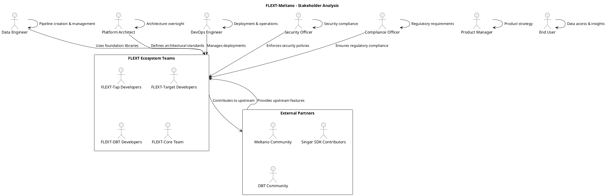
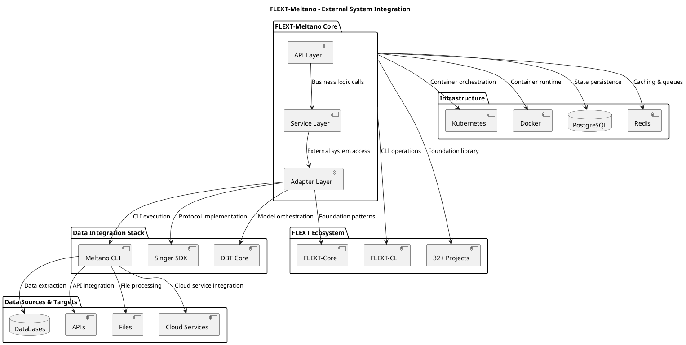
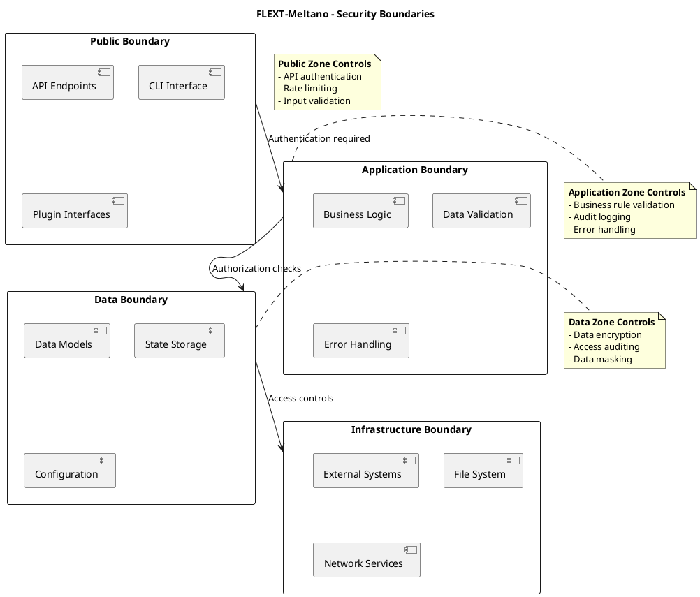

# System Context Documentation

**FLEXT-Meltano Ecosystem Integration and System Context**

**Version**: 1.0 | **Last Updated**: 2025-10-10

---

## 📋 Table of Contents

1. [System Purpose and Scope](#system-purpose-and-scope)
2. [Stakeholder Analysis](#stakeholder-analysis)
3. [External System Integration](#external-system-integration)
4. [Ecosystem Architecture](#ecosystem-architecture)
5. [System Boundaries](#system-boundaries)
6. [Integration Patterns](#integration-patterns)
7. [Deployment Contexts](#deployment-contexts)

---

## 🎯 System Purpose and Scope

### Primary Purpose

**FLEXT-Meltano** is an enterprise-grade data integration platform that serves as the **Meltano integration foundation** for the entire FLEXT ecosystem. It provides comprehensive Singer protocol implementation, plugin development tools, and ELT pipeline orchestration with **zero tolerance for custom ELT implementations**.

### Mission Statement

_To provide the enterprise data integration foundation for the FLEXT ecosystem, enabling seamless ELT operations across 32+ projects while maintaining the highest standards of type safety, reliability, and architectural integrity._

### System Scope

#### In Scope

- ✅ Singer protocol implementation and abstraction
- ✅ Meltano CLI integration and orchestration
- ✅ DBT model execution and management
- ✅ Plugin development framework and tooling
- ✅ Enterprise pipeline orchestration and monitoring
- ✅ FLEXT ecosystem integration patterns
- ✅ Type-safe API design and error handling

#### Out of Scope

- ❌ Direct data source implementations (handled by flext-tap-\* projects)
- ❌ Direct data target implementations (handled by flext-target-\* projects)
- ❌ Custom data transformation logic (handled by flext-dbt-\* projects)
- ❌ User interface development (handled by flext-web/flext-cli)
- ❌ Infrastructure provisioning (handled by deployment tooling)

### Success Criteria

1. **Ecosystem Adoption**: Successfully used by 32+ FLEXT projects
2. **Zero Custom ELT**: No custom Meltano/Singer/DBT implementations in ecosystem
3. **Type Safety**: 100% Pyrefly compliance across all integrations
4. **Performance**: Sub-second API response times, efficient pipeline execution
5. **Reliability**: 99.9% uptime, comprehensive error handling
6. **Maintainability**: Clean architecture enabling easy evolution

---

## 👥 Stakeholder Analysis

### Primary Stakeholders



### Stakeholder Requirements

| Stakeholder            | Primary Needs                                                | Secondary Needs                                  | Success Metrics                         |
| ---------------------- | ------------------------------------------------------------ | ------------------------------------------------ | --------------------------------------- |
| **Data Engineer**      | Easy pipeline creation, reliable execution, good performance | Rich monitoring, error handling, debugging tools | Pipeline success rate, time-to-delivery |
| **Platform Architect** | Clean APIs, extensible design, type safety                   | Documentation, testing, compliance               | Architecture health, ecosystem adoption |
| **DevOps Engineer**    | Reliable deployment, monitoring, scalability                 | Automation, security, compliance                 | Uptime, incident response time          |
| **Security Officer**   | Data protection, access controls, audit logging              | Threat detection, compliance reporting           | Security incidents, compliance scores   |
| **Compliance Officer** | Regulatory compliance, audit trails, data governance         | Privacy controls, retention policies             | Compliance audit results                |
| **Product Manager**    | Feature velocity, user experience, reliability               | Analytics, reporting, stakeholder management     | User satisfaction, feature adoption     |
| **End User**           | Reliable data access, performance, data quality              | Self-service, documentation, support             | Data availability, query performance    |

### Stakeholder Value Proposition

#### For Data Engineers

- **Unified API**: Single interface for all ELT operations
- **Type Safety**: Compile-time error prevention
- **Railway Pattern**: Predictable error handling
- **Ecosystem Consistency**: Same patterns across all projects

#### For Platform Architects

- **Clean Architecture**: Layered design with clear boundaries
- **Domain-Driven Design**: Business logic drives architecture
- **Zero Custom ELT**: Prevents architectural drift
- **Comprehensive Documentation**: Architecture decision records

#### For DevOps Teams

- **Container-Ready**: Docker and Kubernetes support
- **Monitoring Integration**: Comprehensive observability
- **Automated Deployment**: Infrastructure as code
- **Security Hardening**: Enterprise security controls

#### For Security Teams

- **Defense in Depth**: Multiple security layers
- **Audit Logging**: Comprehensive security events
- **Compliance Framework**: GDPR, SOC2, HIPAA support
- **Threat Modeling**: Proactive security analysis

---

## 🔗 External System Integration

### Core Integration Points



### Integration Architecture

#### FLEXT-Core Integration

```python
# FLEXT-Meltano uses FLEXT-Core patterns extensively
from flext_core import (
    FlextResult,      # Railway-oriented error handling
    FlextContainer,   # Dependency injection
    FlextModels,      # Base model classes
    FlextLogger,      # Structured logging
    FlextService      # Base service class
)

class FlextMeltanoService(FlextService):
    """FLEXT-Meltano service extending FLEXT-Core patterns."""

    def discover_plugins(self) -> FlextResult[List[PluginInfo]]:
        """Plugin discovery with FLEXT error handling."""
        try:
            plugins = self.adapter.list_plugins()
            validated_plugins = [
                self.validate_plugin(plugin) for plugin in plugins
            ]
            return FlextResult.ok(validated_plugins)
        except Exception as e:
            return FlextResult.fail(
                MeltanoError(f"Plugin discovery failed: {e}")
            )
```

#### Meltano CLI Integration

```python
class MeltanoAdapter:
    """Meltano CLI integration with proper error handling."""

    def run_meltano_command(self, command: str, **kwargs) -> FlextResult[MeltanoResult]:
        """Execute Meltano CLI command safely."""

        # Build command with proper escaping
        cmd = ["meltano", command]
        if kwargs:
            for key, value in kwargs.items():
                cmd.extend([f"--{key}", str(value)])

        try:
            # Execute with timeout and proper error handling
            result = subprocess.run(
                cmd,
                capture_output=True,
                text=True,
                timeout=self.command_timeout,
                cwd=self.project_root
            )

            if result.returncode == 0:
                return FlextResult.ok(MeltanoResult(
                    success=True,
                    output=result.stdout,
                    command=cmd
                ))
            else:
                return FlextResult.fail(MeltanoExecutionError(
                    f"Meltano command failed: {result.stderr}",
                    command=cmd,
                    return_code=result.returncode
                ))

        except subprocess.TimeoutExpired:
            return FlextResult.fail(MeltanoTimeoutError(
                f"Meltano command timed out after {self.command_timeout}s",
                command=cmd
            ))
```

#### Singer SDK Integration

```python
class FlextMeltanoTap(FlextMeltanoSingerBase, SingerTap):
    """FLEXT tap implementation with ecosystem integration."""

    def __init__(self, config: dict[str, object] = None, **kwargs):
        super().__init__(config, **kwargs)
        # FLEXT logging integration
        self.logger = FlextLogger.get_logger(self.__class__.__name__)

    def discover_streams(self) -> List[FlextMeltanoStream]:
        """Discover streams with FLEXT error handling."""
        try:
            # Singer SDK discovery
            discovered = super().discover_streams()

            # Convert to FLEXT streams
            flext_streams = []
            for stream in discovered:
                flext_stream = FlextMeltanoStream.from_singer_stream(stream)
                flext_streams.append(flext_stream)

            self.logger.info(f"Discovered {len(flext_streams)} streams")
            return flext_streams

        except Exception as e:
            self.logger.error(f"Stream discovery failed: {e}")
            raise SingerDiscoveryError(f"Failed to discover streams: {e}")

    def run_tap(self) -> None:
        """Run tap with FLEXT state management."""
        try:
            # FLEXT state initialization
            state_manager = FlextMeltanoStateManager(self.config)

            # Run with state tracking
            with state_manager.state_context():
                super().run_tap()

        except Exception as e:
            self.logger.error(f"Tap execution failed: {e}")
            raise SingerExecutionError(f"Tap execution failed: {e}")
```

### Integration Patterns

#### Adapter Pattern for External Systems

```python
# External system integration via adapters
class ExternalSystemAdapter(Protocol):
    """Protocol for external system adapters."""

    def connect(self) -> FlextResult[Connection]:
        """Establish connection to external system."""
        ...

    def execute_operation(self, operation: Operation) -> FlextResult[Result]:
        """Execute operation on external system."""
        ...

    def disconnect(self) -> FlextResult[None]:
        """Clean up connection to external system."""
        ...

# Concrete adapter implementations
class MeltanoAdapter(ExternalSystemAdapter):
    """Meltano CLI adapter."""

class FlextMeltanoAdapter.Dbt(ExternalSystemAdapter):
    """DBT adapter."""

class FlextMeltanoAdapter.Singer(ExternalSystemAdapter):
    """Singer protocol adapter."""
```

#### Plugin Architecture for Extensibility

```python
class PluginManager:
    """Plugin management system for ecosystem extensibility."""

    def __init__(self):
        self.plugin_registry: Dict[str, PluginInfo] = {}
        self.plugin_loaders: List[PluginLoader] = []

    def register_plugin(self, plugin_info: PluginInfo) -> FlextResult[None]:
        """Register a plugin in the ecosystem."""
        if plugin_info.name in self.plugin_registry:
            return FlextResult.fail(
                PluginError(f"Plugin {plugin_info.name} already registered")
            )

        # Validate plugin compatibility
        validation_result = self.validate_plugin_compatibility(plugin_info)
        if validation_result.is_failure:
            return validation_result

        self.plugin_registry[plugin_info.name] = plugin_info
        self.logger.info(f"Registered plugin: {plugin_info.name}")
        return FlextResult.ok(None)

    def load_plugin(self, name: str) -> FlextResult[Plugin]:
        """Load and initialize a plugin."""
        if name not in self.plugin_registry:
            return FlextResult.fail(
                PluginError(f"Plugin {name} not found in registry")
            )

        plugin_info = self.plugin_registry[name]

        # Load plugin using appropriate loader
        for loader in self.plugin_loaders:
            if loader.can_load(plugin_info):
                return loader.load_plugin(plugin_info)

        return FlextResult.fail(
            PluginError(f"No loader found for plugin {name}")
        )
```

---

## 🌐 Ecosystem Architecture

### FLEXT Ecosystem Structure

```plantuml
@startuml FLEXT Ecosystem Architecture
title FLEXT-Meltano - Ecosystem Architecture

cloud "FLEXT Ecosystem" as ecosystem {
    rectangle "Foundation Layer" as foundation {
        component "FLEXT-Core" as flext_core [
            Foundation Patterns
            FlextResult[T], FlextContainer
            Type Safety, Error Handling
        ]

        component "FLEXT-Meltano" as flext_meltano [
            Data Integration Foundation
            Singer Protocol, Meltano Integration
            Pipeline Orchestration
        ]
    }

    rectangle "Domain Layer" as domain {
        rectangle "Singer Integration" as singer_domain {
            component "FLEXT-Tap-* (6 projects)" as tap_projects [
                Data Source Integration
                GitHub, GitLab, Salesforce, etc.
            ]

            component "FLEXT-Target-* (6 projects)" as target_projects [
                Data Target Integration
                PostgreSQL, Snowflake, BigQuery, etc.
            ]
        }

        rectangle "DBT Integration" as dbt_domain {
            component "FLEXT-DBT-* (4 projects)" as dbt_projects [
                Data Transformation
                Modeling, Testing, Documentation
            ]
        }

        rectangle "Specialized Projects" as specialized {
            component "ALGAR-OUD-Mig" as algar [
                Oracle Migration
                Legacy System Integration
            ]

            component "FLEXT-LDAP" as ldap [
                Directory Services
                Authentication Integration
            ]
        }
    }

    rectangle "Application Layer" as application {
        component "FLEXT-CLI" as flext_cli [
            Command Line Interface
            Pipeline Management Tools
        ]

        component "FLEXT-Web" as flext_web [
            Web Interface
            Dashboard, Monitoring
        ]

        component "FLEXT-API" as flext_api [
            REST API Services
            Integration Endpoints
        ]
    }

    rectangle "Infrastructure Layer" as infrastructure {
        component "FLEXT-Observability" as observability [
            Monitoring & Alerting
            Metrics, Logging, Tracing
        ]

        component "FLEXT-Security" as security [
            Security Services
            Authentication, Authorization
        ]
    }
}

' Dependency relationships
foundation --> domain: Foundation library
domain --> application: Domain services
application --> infrastructure: Infrastructure services

' FLEXT-Meltano as central hub
flext_meltano --> tap_projects: Tap foundation
flext_meltano --> target_projects: Target foundation
flext_meltano --> dbt_projects: DBT foundation

note right of flext_meltano
    **Central Integration Hub**
    - 32+ dependent projects
    - Zero custom ELT code
    - Enterprise pipeline orchestration
end note
@enduml
```

### Ecosystem Integration Patterns

#### Foundation Library Pattern

All FLEXT projects follow consistent integration patterns:

```python
# Standard FLEXT project structure
from flext_core import FlextBus
from flext_core import FlextConfig
from flext_core import FlextConstants
from flext_core import FlextContainer
from flext_core import FlextContext
from flext_core import FlextDecorators
from flext_core import FlextDispatcher
from flext_core import FlextExceptions
from flext_core import h
from flext_core import FlextLogger
from flext_core import x
from flext_core import FlextModels
from flext_core import FlextProcessors
from flext_core import p
from flext_core import FlextRegistry
from flext_core import FlextResult
from flext_core import FlextRuntime
from flext_core import FlextService
from flext_core import t
from flext_core import u
from flext_meltano import FlextMeltanoTap, FlextMeltanoTarget

class MyFLEXTProject(FlextService):
    """FLEXT project extending foundation patterns."""

    def __init__(self):
        super().__init__()
        # Use FLEXT-Meltano for data integration
        self.tap = FlextMeltanoTap()
        self.target = FlextMeltanoTarget()

    def execute_pipeline(self) -> FlextResult[PipelineResult]:
        """Execute pipeline using FLEXT foundation."""
        return (
            self.tap.discover_streams()
            .flat_map(lambda streams: self.validate_streams(streams))
            .flat_map(lambda _: self.target.initialize())
            .flat_map(lambda _: self.run_data_flow())
            .map(lambda result: PipelineResult.from_execution(result))
        )
```

#### Plugin Ecosystem Integration

```python
class FLEXTPluginRegistry:
    """Central plugin registry for ecosystem coordination."""

    def __init__(self):
        self.registered_plugins: Dict[str, PluginMetadata] = {}

    def register_flext_plugin(self, plugin: FLEXTPlugin) -> FlextResult[None]:
        """Register a FLEXT plugin in the ecosystem."""

        # Validate plugin compatibility
        compatibility_result = self.validate_plugin_compatibility(plugin)
        if compatibility_result.is_failure:
            return compatibility_result

        # Register with FLEXT-Meltano
        registration_result = self.meltano_adapter.register_plugin(plugin)
        if registration_result.is_failure:
            return registration_result

        # Add to ecosystem registry
        self.registered_plugins[plugin.name] = PluginMetadata(
            name=plugin.name,
            version=plugin.version,
            type=plugin.plugin_type,
            dependencies=plugin.dependencies,
            capabilities=plugin.capabilities
        )

        return FlextResult.ok(None)

    def discover_compatible_plugins(self, requirements: PluginRequirements) -> List[PluginMetadata]:
        """Discover plugins that meet specific requirements."""
        compatible = []

        for plugin_meta in self.registered_plugins.values():
            if self.plugin_meets_requirements(plugin_meta, requirements):
                compatible.append(plugin_meta)

        return sorted(compatible, key=lambda p: p.version, reverse=True)
```

---

## 🔲 System Boundaries

### Functional Boundaries

#### Data Integration Boundary

- **Inside**: Singer protocol implementation, Meltano orchestration, DBT execution
- **Outside**: Specific data source/target implementations (handled by domain projects)
- **Interface**: Plugin API, configuration schemas, execution results

#### Application Boundary

- **Inside**: Business logic, validation, error handling, state management
- **Outside**: User interfaces, external APIs, infrastructure concerns
- **Interface**: REST APIs, CLI commands, plugin interfaces

#### Infrastructure Boundary

- **Inside**: Application code, business rules, data models
- **Outside**: Operating system, network, storage, external services
- **Interface**: Environment variables, configuration files, service contracts

### Security Boundaries



### Integration Boundaries

| Boundary Type                | Crossing Mechanism   | Security Controls                      | Monitoring                           |
| ---------------------------- | -------------------- | -------------------------------------- | ------------------------------------ |
| **API Boundary**             | REST/HTTP calls      | JWT authentication, rate limiting      | Request logging, performance metrics |
| **Plugin Boundary**          | Plugin interfaces    | Plugin validation, sandboxing          | Plugin execution monitoring          |
| **Data Boundary**            | Database connections | Connection encryption, access controls | Query logging, data access auditing  |
| **External System Boundary** | CLI subprocess calls | Command validation, timeout controls   | Execution monitoring, error handling |

---

## 🔄 Integration Patterns

### Synchronous Integration Patterns

#### Request-Response Pattern

```python
class SynchronousIntegration:
    """Synchronous request-response integration pattern."""

    def execute_sync_operation(self, request: OperationRequest) -> FlextResult[OperationResponse]:
        """Execute synchronous operation with timeout and error handling."""

        # Validate request
        validation_result = self.validate_request(request)
        if validation_result.is_failure:
            return validation_result

        # Execute operation with timeout
        try:
            with self.timeout_context(self.operation_timeout):
                response = self.external_system.execute_operation(request)
                return FlextResult.ok(self.adapt_response(response))

        except TimeoutError:
            return FlextResult.fail(IntegrationTimeoutError(
                f"Operation timed out after {self.operation_timeout}s"
            ))

        except ExternalSystemError as e:
            return FlextResult.fail(IntegrationError(
                f"External system error: {e.message}"
            ))
```

#### Circuit Breaker Pattern

```python
class CircuitBreakerIntegration:
    """Circuit breaker pattern for external system integration."""

    def __init__(self, failure_threshold: int = 5, recovery_timeout: int = 60):
        self.failure_threshold = failure_threshold
        self.recovery_timeout = recovery_timeout
        self.failure_count = 0
        self.last_failure_time = None
        self.state = CircuitState.CLOSED

    def execute_with_circuit_breaker(self, operation: Callable) -> FlextResult[object]:
        """Execute operation with circuit breaker protection."""

        if self.state == CircuitState.OPEN:
            if self._should_attempt_reset():
                self.state = CircuitState.HALF_OPEN
            else:
                return FlextResult.fail(CircuitBreakerError("Circuit breaker is OPEN"))

        try:
            result = operation()

            if self.state == CircuitState.HALF_OPEN:
                self._reset_circuit()

            return result

        except Exception as e:
            self._record_failure()
            return FlextResult.fail(IntegrationError(f"Operation failed: {e}"))

    def _record_failure(self) -> None:
        """Record operation failure and update circuit state."""
        self.failure_count += 1
        self.last_failure_time = datetime.utcnow()

        if self.failure_count >= self.failure_threshold:
            self.state = CircuitState.OPEN

    def _should_attempt_reset(self) -> bool:
        """Check if circuit should attempt to reset."""
        if self.last_failure_time is None:
            return True

        time_since_failure = (datetime.utcnow() - self.last_failure_time).total_seconds()
        return time_since_failure >= self.recovery_timeout
```

### Asynchronous Integration Patterns

#### Event-Driven Pattern

```python
class EventDrivenIntegration:
    """Event-driven integration for asynchronous operations."""

    def __init__(self, event_queue, event_handlers: Dict[str, Callable]):
        self.event_queue = event_queue
        self.event_handlers = event_handlers

    def publish_event(self, event: IntegrationEvent) -> FlextResult[None]:
        """Publish integration event to queue."""

        try:
            # Validate event
            validation_result = self.validate_event(event)
            if validation_result.is_failure:
                return validation_result

            # Publish to queue
            self.event_queue.publish(event.event_type, event.payload)

            # Log event
            self.logger.info(f"Published event: {event.event_type}")

            return FlextResult.ok(None)

        except Exception as e:
            return FlextResult.fail(EventPublishingError(f"Failed to publish event: {e}"))

    def process_events(self) -> None:
        """Process incoming integration events."""

        while True:
            try:
                # Get next event
                event = self.event_queue.get_next_event()

                if event:
                    # Route to appropriate handler
                    handler = self.event_handlers.get(event.event_type)
                    if handler:
                        result = handler(event.payload)
                        if result.is_success:
                            self.event_queue.mark_processed(event)
                        else:
                            self.handle_processing_error(event, result.error)
                    else:
                        self.logger.warning(f"No handler for event type: {event.event_type}")

            except Exception as e:
                self.logger.error(f"Event processing error: {e}")
                time.sleep(self.error_backoff_seconds)
```

#### Message Queue Integration

```python
class MessageQueueIntegration:
    """Message queue integration for reliable asynchronous communication."""

    def __init__(self, queue_client, dead_letter_queue):
        self.queue_client = queue_client
        self.dead_letter_queue = dead_letter_queue
        self.max_retries = 3

    def send_message(self, message: QueueMessage) -> FlextResult[None]:
        """Send message to queue with reliability guarantees."""

        try:
            # Add message metadata
            enriched_message = self.enrich_message(message)

            # Send with delivery confirmation
            message_id = self.queue_client.send_message(
                queue_url=self.queue_url,
                message_body=json.dumps(enriched_message),
                message_attributes=self.get_message_attributes(enriched_message)
            )

            self.logger.info(f"Sent message: {message_id}")
            return FlextResult.ok(None)

        except Exception as e:
            return FlextResult.fail(QueueError(f"Failed to send message: {e}"))

    def receive_and_process_messages(self, message_processor: Callable) -> None:
        """Receive and process messages from queue."""

        while True:
            try:
                # Receive messages
                messages = self.queue_client.receive_messages(
                    queue_url=self.queue_url,
                    max_messages=10,
                    wait_time_seconds=20
                )

                for message in messages:
                    try:
                        # Process message
                        payload = json.loads(message.body)
                        result = message_processor(payload)

                        if result.is_success:
                            # Delete processed message
                            self.queue_client.delete_message(
                                queue_url=self.queue_url,
                                receipt_handle=message.receipt_handle
                            )
                        else:
                            # Handle processing failure
                            self.handle_processing_failure(message, result.error)

                    except Exception as e:
                        self.handle_processing_failure(message, e)

            except Exception as e:
                self.logger.error(f"Message processing error: {e}")
                time.sleep(self.error_backoff_seconds)

    def handle_processing_failure(self, message, error) -> None:
        """Handle message processing failure with retry logic."""

        retry_count = message.attributes.get('retry_count', 0)

        if retry_count < self.max_retries:
            # Retry with backoff
            retry_count += 1
            delay_seconds = 2 ** retry_count  # Exponential backoff

            # Update message for retry
            message.attributes['retry_count'] = retry_count
            message.attributes['next_retry_time'] = datetime.utcnow().timestamp() + delay_seconds

            # Re-queue message
            self.queue_client.send_message(
                queue_url=self.queue_url,
                message_body=message.body,
                message_attributes=message.attributes,
                delay_seconds=delay_seconds
            )
        else:
            # Move to dead letter queue
            self.dead_letter_queue.send_message(
                queue_url=self.dead_letter_queue_url,
                message_body=message.body,
                message_attributes={
                    **message.attributes,
                    'final_error': str(error),
                    'failed_at': datetime.utcnow().isoformat()
                }
            )

        # Delete original message
        self.queue_client.delete_message(
            queue_url=self.queue_url,
            receipt_handle=message.receipt_handle
        )
```

---

## 🚀 Deployment Contexts

### Development Context

```plantuml
@startuml Development Deployment
title FLEXT-Meltano - Development Context

rectangle "Developer Workstation" as workstation {
    component "Local Python Environment" as python_env [
        Python 3.13
        Poetry dependencies
        Local development tools
    ]

    component "Local Services" as local_services [
        SQLite (state)
        Local file system
        Mock external services
    ]

    component "Development Tools" as dev_tools [
        VS Code / PyCharm
        pytest, mypy, ruff
        Docker Desktop
    ]
}

component "FLEXT-Meltano" as flext_meltano [
    Local development instance
    Hot reload, debugging
    Test execution
]

component "External Dependencies" as external [
    Meltano CLI (local)
    DBT CLI (local)
    Test databases
]

' Development workflow
python_env --> flext_meltano: Runs
flext_meltano --> local_services: Local storage
flext_meltano --> external: Local integration
dev_tools --> flext_meltano: Development, debugging
dev_tools --> python_env: Code editing

note right of workstation
    **Development Features**
    - Hot reload
    - Interactive debugging
    - Local test execution
    - Mocked external services
end note
@enduml
```

### Staging Context

```plantuml
@startuml Staging Deployment
title FLEXT-Meltano - Staging Context

rectangle "Staging Environment" as staging {
    component "Kubernetes Cluster" as k8s [
        Container orchestration
        Service mesh (Istio)
        Ingress controller
    ]

    component "FLEXT-Meltano Services" as services [
        API service
        Worker pods
        Background jobs
    ]

    database "Staging Databases" as databases [
        PostgreSQL (state)
        Redis (cache)
        Test data warehouse
    ]

    component "Monitoring Stack" as monitoring [
        Prometheus metrics
        ELK logging
        Jaeger tracing
    ]
}

component "CI/CD Pipeline" as cicd [
    Automated testing
    Security scanning
    Performance testing
]

component "External Systems" as external [
    Staging Meltano
    Test data sources
    Staging DBT
]

cicd --> staging: Automated deployment
staging --> external: Integration testing
monitoring --> staging: Observability
databases --> services: Data persistence

note right of staging
    **Staging Characteristics**
    - Production-like environment
    - Automated testing integration
    - Performance and load testing
    - Security validation
end note
@enduml
```

### Production Context

```plantuml
@startuml Production Deployment
title FLEXT-Meltano - Production Context

rectangle "Production Environment" as production {
    rectangle "Multi-AZ Kubernetes" as k8s {
        component "API Services" as api_services [
            Load balanced API pods
            Auto-scaling enabled
            Health checks
        ]

        component "Worker Pools" as workers [
            Background processing
            Job queues
            Error recovery
        ]

        component "Ingress Layer" as ingress [
            API Gateway
            Rate limiting
            SSL termination
        ]
    }

    rectangle "Data Layer" as data_layer {
        database "Primary PostgreSQL" as primary_db [
            State management
            Transaction processing
            High availability
        ]

        database "Read Replicas" as read_replicas [
            Query offloading
            Reporting workloads
        ]

        component "Redis Cluster" as redis [
            Distributed caching
            Session storage
            Job queues
        ]

        database "Data Warehouse" as warehouse [
            Analytics data
            Historical storage
            DBT transformations
        ]
    }

    rectangle "External Integrations" as external {
        component "Meltano Infrastructure" as meltano_infra
        component "DBT Pipeline" as dbt_pipeline
        component "Data Sources" as data_sources
        component "Monitoring" as monitoring
    }
}

component "Load Balancer" as lb
component "CDN" as cdn
component "WAF" as waf

' Production architecture
lb --> ingress: Traffic distribution
ingress --> api_services: API routing
api_services --> workers: Background jobs
workers --> data_layer: Data operations
ingress --> waf: Security filtering
cdn --> lb: Content delivery

' External integrations
api_services --> external: Data operations
external --> data_layer: Data flow
monitoring --> production: Observability

note right of production
    **Production Requirements**
    - High availability
    - Auto-scaling
    - Disaster recovery
    - Security hardening
    - Performance monitoring
end note
@enduml
```

### Deployment Pattern Comparison

| Context         | Scale                  | Reliability | Security | Cost   | Purpose             |
| --------------- | ---------------------- | ----------- | -------- | ------ | ------------------- |
| **Development** | Single instance        | Basic       | Minimal  | Low    | Feature development |
| **Staging**     | Multi-instance         | Medium      | Medium   | Medium | Integration testing |
| **Production**  | Multi-AZ, auto-scaling | High        | High     | High   | Live operations     |

---

## 📊 System Context Summary

### Key Architectural Characteristics

1. **Ecosystem Foundation**: Central integration hub for 32+ FLEXT projects
2. **Zero Custom ELT**: Absolute prohibition of custom Meltano/Singer/DBT implementations
3. **Type Safety First**: 100% Pyrefly compliance across all integrations
4. **Railway-Oriented**: Consistent error handling with FlextResult[T] pattern
5. **Clean Architecture**: Domain-Driven Design with clear layer separation

### System Qualities

- **Reliability**: Railway pattern ensures predictable error handling
- **Maintainability**: Clean architecture enables independent evolution
- **Extensibility**: Plugin architecture supports ecosystem growth
- **Security**: Defense-in-depth with comprehensive controls
- **Performance**: Efficient execution with monitoring and optimization

### Integration Philosophy

**FLEXT-Meltano serves as the "integration glue"** that binds the FLEXT ecosystem together, providing consistent patterns, shared infrastructure, and enterprise-grade capabilities while allowing domain projects to focus on their specific data integration needs.

---

**System Context**: FLEXT-Meltano Ecosystem Integration and Boundaries
_Comprehensive system context documentation with stakeholder analysis, integration patterns, and deployment contexts_
