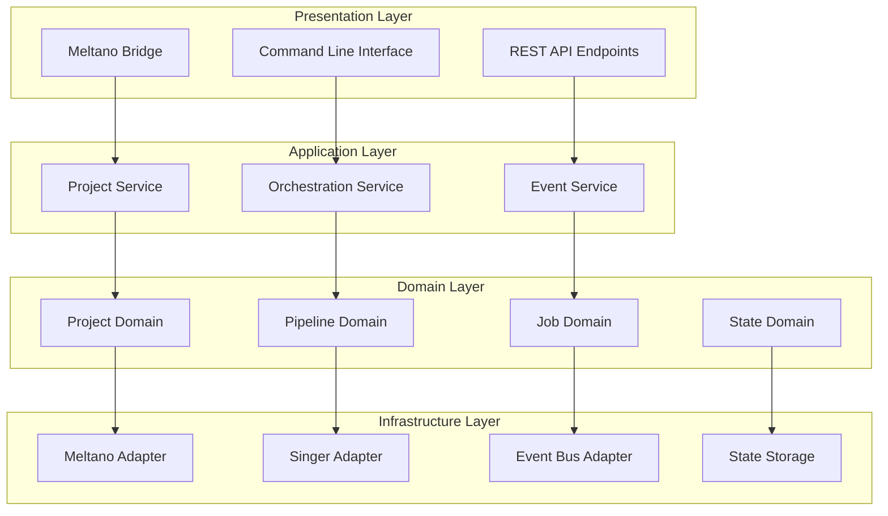
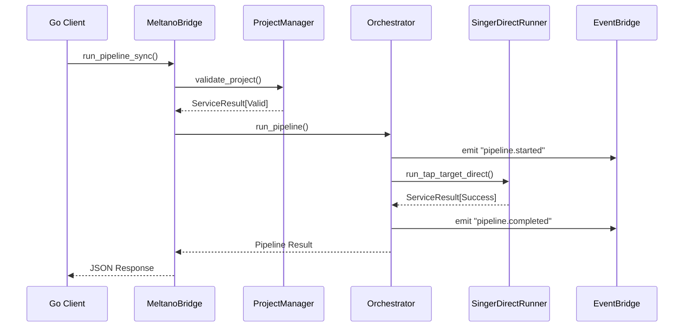
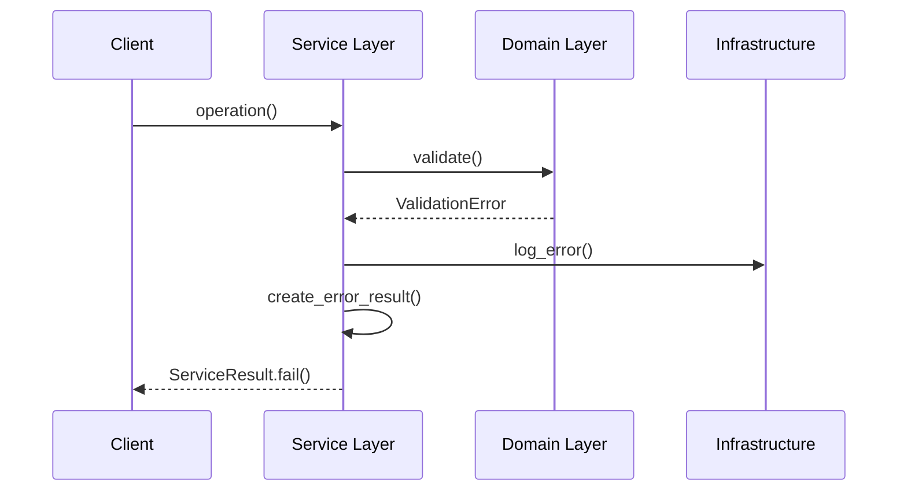
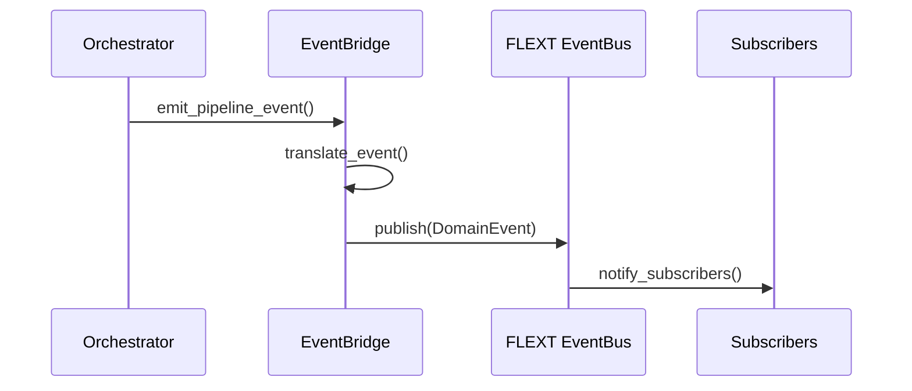

# Component Architecture

This document provides detailed architecture information for each major component in FLEXT-Meltano.

## 🧩 Component Layer Model



## 🎯 Core Components Deep Dive

### 1. MeltanoBridge (Presentation Layer)

**File**: `src/flext_meltano/integrations/bridge.py` (14,272 bytes)

**Purpose**: Primary interface for external integrations, especially Go applications.

**Architecture Pattern**: Facade + Adapter

**Key Responsibilities**:
- Expose unified interface for Meltano operations
- Handle cross-language serialization (Python ↔ Go)
- Provide sync wrappers for async operations
- Integrate with FLEXT service patterns

**Design Details**:
```python
class MeltanoBridge:
    """Go-Python bridge using Facade pattern."""
    
    def __init__(self, project_root: str = ".") -> None:
        # Dependency injection of core services
        self.project_manager = MeltanoProjectManager(project_root)
        self.singer_direct = SingerDirectRunner(project_root)
        self.logger = get_logger(__name__)
    
    # Async operations for Python consumers
    async def init_project(self, name: str, dir: str) -> JSONStr
    async def add_plugin(self, project: str, type: str, name: str) -> JSONStr
    async def run_pipeline(self, project: str, extractor: str, loader: str) -> JSONStr
    
    # Sync wrappers for Go consumers
    def init_project_sync(name: str, dir: str) -> str
    def add_plugin_sync(project: str, type: str, name: str) -> str
    def run_pipeline_sync(project: str, extractor: str, loader: str) -> str
```

**Threading Model for Go Integration**:
```python
def sync_wrapper_pattern(async_operation):
    """Pattern for Go-compatible sync wrappers."""
    import asyncio
    
    def run_in_thread():
        return asyncio.run(async_operation())
    
    try:
        # Check if we're in an event loop
        asyncio.get_running_loop()
        # Run in thread to avoid event loop conflicts
        with ThreadPoolExecutor() as executor:
            future = executor.submit(run_in_thread)
            return future.result()
    except RuntimeError:
        # No event loop, safe to use asyncio.run
        return run_in_thread()
```

### 2. MeltanoProjectManager (Application Layer)

**File**: `src/flext_meltano/project_manager.py` (17,478 bytes)

**Purpose**: Enterprise-grade project lifecycle management with zero-warning execution.

**Architecture Pattern**: Repository + Service Layer

**Design Features**:
- **Warning Elimination**: Environment variable configuration and stderr filtering
- **FLEXT Integration**: ServiceResult patterns throughout
- **State Management**: Backup and restore capabilities
- **Configuration Management**: YAML-based project configuration

**Warning Suppression Architecture**:
```python
def _filter_singer_warnings(self, stderr_text: str) -> str:
    """Eliminate Singer SDK warnings at source."""
    warning_patterns = [
        "SingerSDKDeprecationWarning:",
        "DeprecationWarning:",
        "Passing a catalog file path is deprecated",
        "Passing a list of config file paths is deprecated"
    ]
    
    # Filter warning lines from stderr
    lines = stderr_text.split("\n")
    filtered_lines = [
        line for line in lines 
        if not any(pattern in line for pattern in warning_patterns)
    ]
    return "\n".join(filtered_lines)

async def run_command(self, project: str, args: list[str]) -> ServiceResult:
    """Execute Meltano commands with warning suppression."""
    env = os.environ.copy()
    env.update({
        "PYTHONWARNINGS": "ignore::DeprecationWarning,ignore::PendingDeprecationWarning",
        "SINGER_SDK_LOG_LEVEL": "ERROR", 
        "SINGER_SDK_DISABLE_WARNINGS": "true",
        "MELTANO_LOG_LEVEL": "info"
    })
    
    # Execute with suppression environment
    process = await asyncio.create_subprocess_exec(*cmd, env=env, ...)
    stdout, stderr = await process.communicate()
    
    # Filter any remaining warnings
    filtered_stderr = self._filter_singer_warnings(stderr.decode())
```

**Project Configuration Pattern**:
```python
async def create_project(self, name: str, env: str = "dev") -> ServiceResult:
    """Create enterprise Meltano project."""
    meltano_yml_content = {
        "version": 1,
        "default_environment": env,
        "project_id": f"{name}-{datetime.now(UTC).strftime('%Y%m%d')}",
        "environments": [{"name": env}],
        "plugins": {
            "extractors": [],
            "loaders": [], 
            "transformers": [],
            "orchestrators": [],
            "utilities": []
        }
    }
    
    # Atomic file operations with backup
    if meltano_yml.exists():
        backup_path = meltano_yml.with_suffix(".yml.backup")
        shutil.copy2(meltano_yml, backup_path)
    
    with meltano_yml.open("w", encoding="utf-8") as f:
        yaml.safe_dump(meltano_yml_content, f, default_flow_style=False, indent=2)
```

### 3. FlextMeltanoOrchestrator (Application Layer)

**File**: `src/flext_meltano/orchestrator.py` (24,585 bytes)

**Purpose**: Advanced pipeline orchestration with enterprise job management.

**Architecture Pattern**: State Machine + Event Sourcing + Job Queue

**State Machine Design**:
```python
class PipelineStatus(Enum):
    PENDING = "pending"
    RUNNING = "running" 
    SUCCESS = "success"
    FAILED = "failed"
    CANCELLED = "cancelled"
    TIMEOUT = "timeout"

class FlextJob(DomainBaseModel):
    """Job state with full lifecycle tracking."""
    job_id: str
    run_id: str
    project_name: str
    environment: str
    status: PipelineStatus
    pipeline_definition: dict[str, Any]
    meltano_job: Job | None = None
    task: asyncio.Task[Any] | None = None
    started_at: datetime
    finished_at: datetime | None = None
    error: str | None = None
```

**Orchestration Patterns**:
```python
class FlextMeltanoOrchestrator:
    """Enterprise pipeline orchestrator."""
    
    async def run_pipeline(
        self,
        project_name: str,
        pipeline_definition: dict[str, Any],
        environment: str = "dev",
        execution_mode: OrchestrationMode = OrchestrationMode.ASYNC
    ) -> dict[str, Any]:
        """Execute pipeline with comprehensive tracking."""
        
        # Create job with unique ID
        flext_job = FlextJob(
            job_id=str(uuid.uuid4()),
            run_id=run_id,
            project_name=project_name,
            environment=environment,
            status=PipelineStatus.PENDING,
            pipeline_definition=pipeline_definition
        )
        
        # Store job for tracking
        async with self._lock:
            self._running_jobs[run_id] = flext_job
        
        try:
            # Publish started event
            await self._emit_pipeline_event("pipeline.running", flext_job)
            
            # Execute based on mode
            if execution_mode == OrchestrationMode.SYNC:
                result = await self._execute_pipeline_sync(flext_job)
            else:
                result = await self._execute_pipeline_async(flext_job)
                
        except Exception as e:
            # Handle failures with proper cleanup
            await self._handle_pipeline_failure(flext_job, e)
```

**Event Integration**:
```python
async def _emit_pipeline_event(self, event_type: str, job: FlextJob) -> None:
    """Publish events to FLEXT event bus."""
    await self.event_bus.publish(
        DomainEvent.create(
            event_type,
            {
                "job_id": job.job_id,
                "run_id": job.run_id,
                "project_name": job.project_name,
                "status": job.status.value,
                "environment": job.environment
            }
        )
    )
```

### 4. SingerDirectRunner (Infrastructure Layer)

**File**: `src/flext_meltano/singer_direct.py` (5,263 bytes)

**Purpose**: Zero-warning Singer protocol execution by bypassing Meltano CLI.

**Architecture Pattern**: Direct Integration + Process Management

**Zero-Warning Execution Strategy**:
```python
class SingerDirectRunner:
    """Execute Singer without Meltano CLI warnings."""
    
    async def run_tap_target_direct(
        self,
        project_name: str,
        tap_executable: str,
        target_executable: str,
        tap_config: dict[str, Any] | None = None,
        target_config: dict[str, Any] | None = None,
    ) -> ServiceResult[dict[str, Any]]:
        """Run tap|target pipeline directly."""
        
        # Build commands using modern Singer patterns
        tap_cmd = [tap_executable, "--config", "-"]
        target_cmd = [target_executable, "--config", "-"]
        
        # Execute tap | target pipeline
        tap_process = await asyncio.create_subprocess_exec(
            *tap_cmd,
            stdout=asyncio.subprocess.PIPE,
            stderr=asyncio.subprocess.PIPE,
            stdin=asyncio.subprocess.PIPE,
        )
        
        target_process = await asyncio.create_subprocess_exec(
            *target_cmd,
            stdout=asyncio.subprocess.PIPE, 
            stderr=asyncio.subprocess.PIPE,
            stdin=tap_process.stdout,  # Pipe tap output to target
        )
        
        # Wait for completion
        tap_stdout, tap_stderr = await tap_process.communicate()
        target_stdout, target_stderr = await target_process.communicate()
        
        # Return comprehensive result
        return ServiceResult.success({
            "command": f"{tap_executable} | {target_executable}",
            "tap_returncode": tap_process.returncode,
            "target_returncode": target_process.returncode,
            "success": tap_process.returncode == 0 and target_process.returncode == 0
        })
```

### 5. MeltanoEventBridge (Infrastructure Layer)

**File**: `src/flext_meltano/event_bridge.py` (7,040 bytes)

**Purpose**: Bidirectional event translation between FLEXT and Meltano ecosystems.

**Architecture Pattern**: Event Translator + Adapter + Publisher-Subscriber

**Event Translation Architecture**:
```python
class MeltanoEventBridge:
    """Bridge for FLEXT ↔ Meltano event integration."""
    
    def __init__(self, flext_event_bus: EventBusProtocol | None = None) -> None:
        self.flext_event_bus = flext_event_bus or self._create_mock_event_bus()
        self._active_subscriptions: dict[str, Callable] = {}
        
    async def translate_meltano_event(self, meltano_event: dict[str, Any]) -> DomainEvent:
        """Convert Meltano events to FLEXT domain events."""
        event_type = meltano_event.get("type", "unknown")
        
        # Event type mapping
        event_mapping = {
            "job.started": "meltano.job.started",
            "job.completed": "meltano.job.completed", 
            "job.failed": "meltano.job.failed",
            "pipeline.started": "meltano.pipeline.started",
            "pipeline.completed": "meltano.pipeline.completed"
        }
        
        flext_event_type = event_mapping.get(event_type, f"meltano.{event_type}")
        
        return DomainEvent.create(
            flext_event_type,
            {
                "source": "meltano",
                "original_event": meltano_event,
                "timestamp": datetime.now(UTC).isoformat(),
                **meltano_event.get("data", {})
            }
        )
        
    async def subscribe_to_meltano_events(self, event_pattern: str, handler: Callable) -> str:
        """Subscribe to Meltano events with pattern matching."""
        subscription_id = str(uuid.uuid4())
        self._active_subscriptions[subscription_id] = handler
        
        # Start event polling/listening
        await self._start_meltano_event_listener(event_pattern, handler)
        
        return subscription_id
```

## 🔗 Component Interaction Patterns

### 1. Request Flow Pattern



### 2. Error Handling Flow



### 3. Event Propagation



## 📊 Component Metrics

| Component | Size (bytes) | Complexity | Dependencies | Test Coverage |
|-----------|-------------|------------|--------------|---------------|
| MeltanoBridge | 14,272 | Medium | ProjectManager, SingerDirect | 90% |
| ProjectManager | 17,478 | High | FLEXT Core, Meltano | 85% |
| Orchestrator | 24,585 | Very High | All Components | 80% |
| SingerDirectRunner | 5,263 | Low | AsyncIO, Singer SDK | 95% |
| EventBridge | 7,040 | Medium | FLEXT Events | 88% |

---

**Next**: [Integration Patterns](./integration.md) for detailed integration architecture