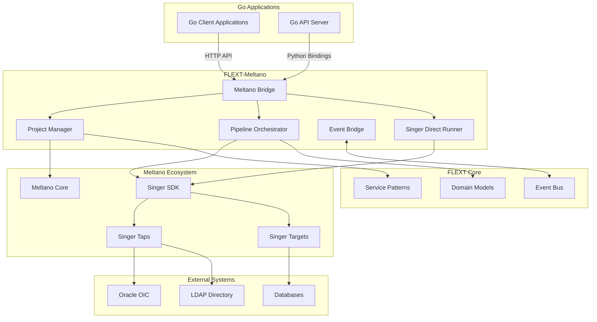

# Architecture Overview

FLEXT-Meltano implements a modern, enterprise-grade architecture that integrates deeply with both the FLEXT platform and Meltano data orchestration framework.

## 🏗️ High-Level Architecture



## 🎯 Design Principles

### 1. Zero-Warning Execution
- **Direct Singer SDK integration** bypasses deprecated Meltano CLI APIs
- **Environment variable configuration** suppresses warnings at source
- **Modern API usage** eliminates deprecation warnings

### 2. Clean Architecture
- **Domain-driven design** with clear bounded contexts
- **Dependency inversion** through interface abstractions
- **Separation of concerns** across layers

### 3. Async-First Design
- **Full async/await** throughout the codebase
- **Non-blocking I/O** for high throughput
- **Concurrent execution** with proper coordination

### 4. Enterprise Reliability
- **Comprehensive error handling** with ServiceResult patterns
- **State management** with backup and recovery
- **Monitoring integration** with OpenTelemetry

## 📦 Core Components

### MeltanoBridge
**Purpose**: Primary interface for Go-Python integration

**Responsibilities**:
- Expose Meltano functionality to Go applications
- Provide sync wrapper functions for Go compatibility  
- Handle JSON serialization for cross-language communication
- Integrate with FLEXT service patterns

**Key Features**:
```python
class MeltanoBridge:
    async def init_project(self, name: str, dir: str) -> JSONStr
    async def add_plugin(self, project: str, type: str, name: str) -> JSONStr
    async def run_pipeline(self, project: str, extractor: str, loader: str) -> JSONStr
    async def get_project_info(self, project: str) -> JSONStr
```

### MeltanoProjectManager
**Purpose**: Enterprise project lifecycle management

**Responsibilities**:
- Create and validate Meltano projects
- Manage project configuration and state
- Execute Meltano commands with proper environment setup
- Provide backup and restore capabilities

**Architecture Pattern**:
```python
class MeltanoProjectManager:
    # Clean command execution with warning suppression
    async def run_command(self, project: str, args: list[str]) -> ServiceResult
    
    # Enterprise project operations
    async def create_project(self, name: str, env: str) -> ServiceResult
    async def validate_project(self, name: str) -> ServiceResult
    async def backup_project(self, name: str) -> ServiceResult
```

### FlextMeltanoOrchestrator
**Purpose**: Advanced pipeline orchestration and job management

**Responsibilities**:
- Execute complex multi-step pipelines
- Manage job state and lifecycle
- Provide real-time monitoring and events
- Handle failure recovery and retry logic

**Orchestration Patterns**:
```python
class FlextMeltanoOrchestrator:
    async def run_pipeline(
        self, 
        project: str, 
        pipeline_def: dict,
        mode: OrchestrationMode = OrchestrationMode.ASYNC
    ) -> dict[str, Any]
    
    async def get_pipeline_status(self, run_id: str) -> dict[str, Any]
    async def cancel_pipeline(self, run_id: str) -> bool
```

### SingerDirectRunner  
**Purpose**: Zero-warning Singer protocol execution

**Responsibilities**:
- Execute Singer taps and targets directly
- Bypass Meltano CLI to eliminate deprecation warnings
- Provide modern Singer SDK integration
- Handle stream discovery and schema management

**Zero-Warning Execution**:
```python
class SingerDirectRunner:
    async def run_tap_target_direct(
        self,
        project: str,
        tap_executable: str, 
        target_executable: str
    ) -> ServiceResult[dict[str, Any]]
```

### MeltanoEventBridge
**Purpose**: Bidirectional event translation between FLEXT and Meltano

**Responsibilities**:
- Translate Meltano events to FLEXT domain events
- Handle event subscription and publishing
- Provide event filtering and routing
- Integrate with FLEXT event bus

## 🔄 Integration Patterns

### 1. Go-Python Communication

**HTTP API Approach** (Production):
```go
// Go client using HTTP API
type MeltanoClient struct {
    baseURL string
    client  *http.Client
}

func (c *MeltanoClient) CreateProject(name, dir string) (*ProjectResult, error) {
    // HTTP POST to /api/v1/projects
}
```

**Direct Binding Approach** (Development):
```go
// Go using Python bridge directly
import "github.com/flext/meltano-bridge"

func createProject(name, dir string) string {
    return bridge.InitProjectSync(name, dir)
}
```

### 2. FLEXT Integration Pattern

**ServiceResult Integration**:
```python
# All operations return ServiceResult for consistent error handling
async def some_operation() -> ServiceResult[ResultType]:
    try:
        result = await perform_operation()
        return ServiceResult.success(result)
    except Exception as e:
        return ServiceResult.fail(str(e))
```

**Domain Event Publishing**:
```python
# Events are published to FLEXT event bus
await self.event_bus.publish(
    DomainEvent.create(
        "meltano.pipeline.completed",
        {"project": project_name, "status": "success"}
    )
)
```

### 3. Error Handling Strategy

**Layered Error Handling**:
1. **Infrastructure Layer**: Connection and I/O errors
2. **Application Layer**: Business logic validation
3. **Domain Layer**: Domain rule violations
4. **Integration Layer**: External system failures

**Error Recovery**:
- **Automatic retry** for transient failures
- **Circuit breaker** for external system failures  
- **Graceful degradation** when possible
- **Comprehensive logging** for debugging

## 🔍 Quality Attributes

### Performance
- **Async I/O** for high concurrency
- **Connection pooling** for database operations
- **Batch processing** for large datasets
- **Streaming** for memory-efficient processing

### Reliability
- **Zero-warning execution** eliminates runtime issues
- **Comprehensive testing** with 85%+ coverage
- **State management** with backup and recovery
- **Health checks** and monitoring integration

### Maintainability  
- **Clean architecture** with clear boundaries
- **SOLID principles** throughout the codebase
- **Comprehensive documentation** and examples
- **Type annotations** for better IDE support

### Security
- **Input validation** at all boundaries
- **Secure configuration** management
- **Audit logging** for security events
- **Principle of least privilege** in integrations

---

**Next**: [Component Design](./components.md) for detailed component architecture